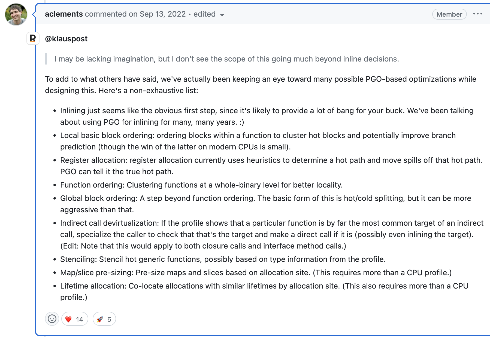
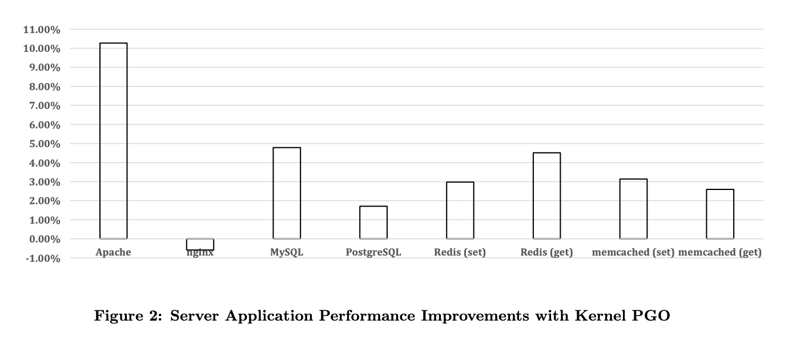

- [PGO in General](#pgo-in-general)
- [PGO in Golang](#pgo-in-golang)
  - [收集 Profile 信息](#收集-profile-信息)
  - [编译优化](#编译优化)
- [PGO for Kernel](#pgo-for-kernel)
- [总结](#总结)


Golang 在 1.20 引入了 [PGO(Profile-guided optimization)](https://go.dev/doc/pgo) 的优化，根据官方博客的介绍可以在不更改代码的情况下达到 2%~7% 的性能提升。在 1.21 的 [Release Note](https://tip.golang.org/doc/go1.21) 中，Golang 将该功能升级到 GA 并在自己的构建中开启了 PGO，将 Golang 自身编译器的性能提升了 2%~4%。PGO 本身是个编译器的优化方法，并不和特定语言相关，Golang 目前也只是很初步的应用了 PGO，这篇文章将会以 Golang 为例介绍 PGO 的工作原理，可能的优化方向和一个应用 PGO 优化 Linux Kernel 的例子。

# PGO in General

通常我们认为静态编译型语言的运行性能要好于动态解释型的语言，但是随着 [JIT(Just In Time)](https://en.wikipedia.org/wiki/Just-in-time_compilation) 技术的引入，动态语言性能有了大幅提升，因为 JIT 可以根据运行时的情况进行针对的强化。

例如：
- 热点代码编译成机器码
- 函数内联
- 分支预测
- 循环展开
- 类型推断
- 内存分配优化
- 寄存器优化

JIT 通过一系列运行时的优化可以达到和编译型语言接近的性能，在部分情况下由于可以动态根据情况做一些编译期间无法确认的优化，甚至会有比编译型语言更好的性能。例如 Golang 中的函数内联是写死的规则稍，主要看函数大小，而不是函数使用频率。分支预测和循环展开编译器由于不知道分支运行时的频率分布，也无法做专门的优化。Golang 中 Slice 和 Map 的初始化大小需要通过参数手动指定或者自动根据写死的规则进行扩容，无法根据运行时信息分配一个合适的初始化大小。

于是一个很自然的想法就是能否将类似 JIT 的技术应用到编译型语言，通过运行时的信息去优化代码性能，传统的做法是通过人类对代码运行时理解的经验，主动的在代码中加入编译提示信息，帮助编译器优化，例如 C++ 中的 inline 函数，C 语言中的宏，GCC 提供的 likely/unlikely。

```c++
#include<stdio.h>
#include<stdlib.h>

#define likely(x) __builtin_expect(!!(x), 1) //gcc内置函数, 帮助编译器分支优化
#define unlikely(x) __builtin_expect(!!(x), 0)

int main(int argc, char* argv[]){
    int x = 0;
    x = atoi(argv[1]);

    if (unlikely(x == 3)){  //告诉编译器这个分支非常不可能为true
        x = x + 9;
    }
    else{
        x = x - 8;
    }

    printf("x=%d\n", x);
    return 0;
}
```

这种方式存在几个问题：

1. 需要对所有分支，函数进行考虑，工作量大，并且调整复杂。
2. 需要依赖程序员凭借经验推测，不一定符合实际场景。
3. 只能对自己编写的代码进行调整比较方便，一些依赖的库函数调整困难，比如一个应用开发者可能需要向下调整到 glibc 的代码。

那么能不能有一种方法可以不调整代码，自动根据运行时的信息对代码的编译进行全局的优化呢，这个方法就是 PGO。通过手机运行时的 Profile 信息反过来优化编译过程。

一个典型的使用 PGO 的工作流分为下面几步：

1. 构建初始版本二进制，不带任何 PGO 的优化。
2. 在生产环境收集 Profile 信息。
3. 重新构建二进制，并使用 2 中收集的 Profile 信息进行构建优化。
4. 回到 2，持续迭代。

但是 PGO 也存在一些自己的问题：

1. 需要配合 pprof 信息，生产环境可能会带来性能下降。
2. 需要随着代码动态调整 Profile 不是个一次性的优化。
3. 整体性能提升有限，Google 通过 [AutoFDO](https://research.google/pubs/pub45290/) 实现了持续的 PGO，整体性能优化在 10% 左右。

# PGO in Golang

Golang 目前有两个主流的编译器，gc(go compiler) 和 [gccgo](https://github.com/golang/gofrontend)。

|   |  gc  |  gccgo  |
|--|--|--|
|优点|<ol>1. 官方支持</ol><ol>2. 兼容性好</ol><ol>3. 编译速度较快</ol>|<ol>1. 可以使用 GCC 更多优化能力，性能较好</ol><ol>2. 可以支持更多 CPU 架构和系统</ol>|
|缺点|<ol>1. 优化较为保守</ol>| <ol>1. 跟随 GCC 发版，不支持 Golang 新特性，潜在兼容性问题</ol><ol>2. 安装使用复杂</ol><ol>3. 较慢编译速度</ol>|

gccgo 使用前后端分离架构，后端已经支持 PGO，这里主要讨论的是官方 gc 的 PGO 优化。

## 收集 Profile 信息

Golang 的 PGO 目前只支持通过 CPU Profile 进行优化，我们可以通过 Golang 标准库里的 runtime/pprof 或者 net/http/pprof 进行 CPU Profile 的采集，如果是其他的 Profile 采集器的数据如果能转换成 [Google pprof](https://github.com/google/pprof/tree/main/proto) 的格式也可以兼容。

需要注意的是由于 PGO 使用的是类似 JIT 的优化方式，因此最好在真实的生产环境收集 Profile 信息，才能最贴合程序实际的运行条件，方便进行后期的优化。也可将多台机器上收集的 Profile 信息进行合并 `go tool pprof -proto a.pprof b.pprof > merged.pprof`.

## 编译优化

`go build -gpo=/tmp/foo.pprof` 即可在编译过程中通过 Profile 信息进行优化。Golang 目前针只实现了[函数内联优化](https://go-review.googlesource.com/c/proposal/+/430398/10/design/55022-pgo-implementation.md#208)，尝试将调用比例大于 2% 的函数进行内联。更多的优化还在画大饼，目前画的大饼可以参考 https://github.com/golang/go/issues/55022#issuecomment-1245605666。




在实践中经常碰到的场景是在跑完 profile 后不会直接重新编译，而是在下次代码变更后再编译发布。这样带来的问题就是 Profile 的信息和代码是存在差异的，Golang 目前通过一些启发式的规则，可以在代码和 Profile 不一致的情况下尽可能的工作。

# PGO for Kernel

PGO 一般用于应用的性能优化，但是一些服务器上的应用有可能是系统调用密集型的，在这种情况下其实可以根据应用对内核进行 PGO，打造一个针对应用优化过后的内核。这里可以参考一下早些年我上学时实验室一个大神师弟的工作 [Profile-Guided Operating System Kernel Optimization](http://coolypf.com/kpgo.htm)，我当时也是通过这个工作才了解到了 PGO。



图片里显示的是不同软件在优化后的吞吐量提升，可以看到在完全不用动应用代码，只是优化内核的编译，吞吐量就会有 2%~10% 的提升。在 Nginx 的例子里出现了性能的下降，我记的当时大神说过是 GCC 在 PGO 的一个 Bug，导致了错误的优化。

# 总结

PGO 是一个不需要改动代码就可以获得性能优化的方法，结合 Golang 的 pprof 可以做很好的配合，但是优化程度也相应有限，而且需要配合发布上线流程，可以作为一个性能优化的尝试。