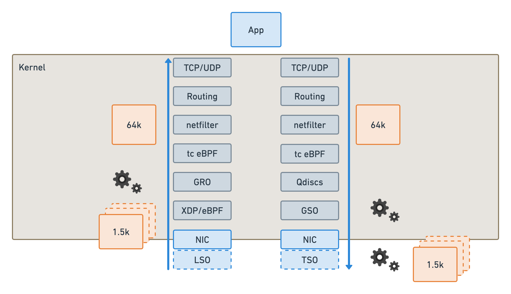

在翻 Cilium Release Blog 时发现了一个叫 Big TCP 的内核技术，这个技术今年 2 月左右刚被合并到内核。看介绍是专门为 100Gbit 以上的高速网络设计的，在将吞吐量提升 50% 的时候还能大幅降低延迟，于是就去了解了一下这个技术。

# 高速网络的性能的瓶颈和误区

提到网络性能，很多人会很自然的联想到网卡的性能，但是做过网络性能优化的人会知道瓶颈更多其实是在 CPU 上。一般使用 iperf3、qperf 这类压测软件进行测试，尤其在小包情况下基本是无法打满网卡带宽的，这时候 CPU 会先于网卡到达瓶颈。

因此做网络性能的优化通常做的都是 CPUU 相关的优化，不管是 DPDK，Offload，XDP 加速的原理要么是绕过内核栈，要么是卸载部分工作给网卡，本质上都是为了节省 CPU 资源，来处理更多的数据包。

以 100G 的网卡为例，以太网的 MTU 是 1500 字节，那么在不做任何优化的情况下 CPU 想要跑满网卡，每秒要处理将近 800 万个数据包，如果每个数据包都要走完整的网络栈，现代 CPU 单核还远远处理不了这个量级的数据包。

为了能让单核跑出尽可能好的网络性能，就需要内核和网卡驱动共同协作，将一部分工作 Offload 给网卡，这也就是 GRO(Generic Receive Offload) 和 TSO(TCP Segment Offload) 相关的技术。

# GRO 和 TSO

CPU 处理不了那么多数据的一个原因是需要给每个数据包封装协议头，计算校验和等等会浪费大量的资源，而在 100G 这种带宽下 1500 的 MTU 又实在太小了，不得不拆分出这么多小的数据包。如果将数据包的拆分和组装交给网卡来做，那么内核需要处理的数据包的规模就降下来了，这就是 GRO 和 TSO 提升性能的基本原理。



如上图所示，在发送数据包的时候内核可以按照 64K 来处理数据包，网卡通过 TSO 拆分成 1.5K 的小包进行传输，接收端网卡通过 GRO 将小包聚合成 64K 的大包在发送给内核处理。这样一来，内核需要处理包的数量就降为了原来的四十分之一。因此理论上开了这两个 Offload 网络的吞吐量在大包的情况下会有数十倍的提升，在我们之前的测试中这个性能大概会差十倍左右。

而且在主流内核和网卡驱动里只支持 TCP 的 Offload，所以经常会看到的一个不太符合直觉的现象就是 iperf3 的 TCP 性能要远远好于 UDP 的性能，差距大概也在十倍左右。

# Big TCP 又做了什么？

既然已经有了这个 Offload 那么 Big TCP 又做了什么呢？Big TCP 要做的事情就是让内核里处理的这个数据包变的更大，这样整体要处理的数据包就会进一步下降来提升性能。之前内核处理的数据包大小为 64K 的主要限制在于 IP 包的头部有个长度字段，这个字段长度为 16bit，因此理论上一个 IP 包最大长度就是 64K。

怎样才能突破这个长度限制呢，内核的作者在这里用了一些很 hack 的方法，在 IPv6 的数据包中有一个 hop-by-hop 的 32 位字段可以存储一些附加信息，那么内核里就可以把 IP 包的长度设置为 0，然后从 hop-by-hop 字段中获取真实的数据包长度，这样一个数据包最大就可以到 4GB 的容量。但是处于稳妥的考虑，目前最大只能设置为 512K，即使这样要处理的数据包也变为了原来的八分之一，相比没有卸载的情况就是将近三百分之一。

根据开发者的[测试](https://lwn.net/Articles/883713/)，吞吐量有将近 50% 的提升，延迟也有将近 30% 的下降，效果可以说相当显著了。

```bash
'Standard' performance with current (74KB) limits.
for i in {1..10}; do ./netperf -t TCP_RR -H iroa23  -- -r80000,80000 -O MIN_LATENCY,P90_LATENCY,P99_LATENCY,THROUGHPUT|tail -1; done
77           138          183          8542.19    
79           143          178          8215.28    
70           117          164          9543.39    
80           144          176          8183.71    
78           126          155          9108.47    
80           146          184          8115.19    
71           113          165          9510.96    
74           113          164          9518.74    
79           137          178          8575.04    
73           111          171          9561.73    

Now enable BIG TCP on both hosts.

ip link set dev eth0 gro_ipv6_max_size 185000 gso_ipv6_max_size 185000
for i in {1..10}; do ./netperf -t TCP_RR -H iroa23  -- -r80000,80000 -O MIN_LATENCY,P90_LATENCY,P99_LATENCY,THROUGHPUT|tail -1; done
57           83           117          13871.38   
64           118          155          11432.94   
65           116          148          11507.62   
60           105          136          12645.15   
60           103          135          12760.34   
60           102          134          12832.64   
62           109          132          10877.68   
58           82           115          14052.93   
57           83           124          14212.58   
57           82           119          14196.01 
```

而 [Big TCP 的 IPv4 支持](https://lwn.net/Articles/920017/)要晚一些，主要原因是 IPv4 内并没有类似 IPv6 中 hop-by-hop 的可选信息字段，因此也就不能在 IP 头中保存真实长度信息。不过作者另辟蹊径，直接从内核的 skb->len 中计算数据包的真实长度信息，反正这个数据包只要在送出去之后长度是正确的就可以，在机器内部其实可以完全依赖 skb 保存状态信息，这样实现了超过 64K 的 TCP 数据包。理论上 IPv4 的做法会更通用，不过 IPv6 已经先实现了，所以就存在了两种不同实现 Big TCP 的方案。

# 总结

这个技术对内核和硬件驱动都有一定的要求，内核需要 6.3 才正式支持，而网卡驱动的支持可能还需要联系硬件厂商。但 Big TCP 还是一个值得令人期待的技术，能够在不需要应用程序调整的情况下显著提升网络的性能，在特定场景下的收益还是很大的。