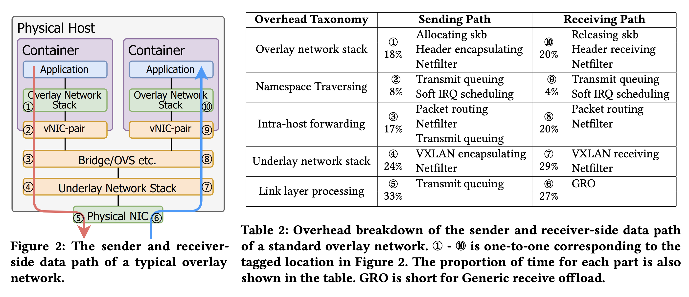

- [为什么要用 Overlay 网络](#为什么要用-overlay-网络)
- [容器 Overlay 网络的开销来源](#容器-overlay-网络的开销来源)
- [如何解决 Overlay 封装的开销](#如何解决-overlay-封装的开销)
- [我的想法](#我的想法)

上周在看 [Antrea](https://antrea.io/) 的[会议纪要](https://github.com/antrea-io/antrea/wiki/Community-Meetings#july-17-2023)时，发现了一篇上海交大和 VMware 合作的论文 —— [XMasq: Low-Overhead Container Overlay Network Based on eBPF](https://arxiv.org/pdf/2305.05455.pdf)。论文里介绍不少通过 eBPF 做容器网络性能优化的方法，不过最令人印象深刻的是他们最终无需给容器数据包封装额外的隧道头就可以实现 Overlay 网络，这里就简单介绍下作者们是如何做到这一点的。

## 为什么要用 Overlay 网络

Overlay 网络相比 Underlay 网络可以完全解耦应用层和底层物理网络,确保两者的灵活性。应用层不需要关心底层物理网络的路由规则等细节,物理网络也不需要针对容器 IP 进行专门路由配置。因此 Overlay 网络作为一种不调底层网络实现的容器组网技术，快速的在容器领域铺开了，主流的开源网络插件处于安装兼容的考虑，基本上都会将 Overlay 作为默认的安装选项。

## 容器 Overlay 网络的开销来源

但是在灵活性的便利下，带来的是性能方面的开销。根据论文里的测量，主流的 Overlay 网络插件，相比于 HOST 网络，吞吐量会下降 25%，CPU 消耗会增加 34%\~44%，延迟会上升 45%\~58%。

当然，这里面的性能开销并不完全是 Overlay 的封装带来的，由于容器网络本身的流量路径和 HOST 网络就有比较大的区别，Overlay 封装其实只是其中的一环。如下图所示：

其中 1\~4，7\~10 都是容器网络相比宿主机网络额外带来的链路，Overlay 的封装主要在 4 和 7，分别占到了 egress 和 ingress 开销的 24% 和 29%。

其他几个链路上的优化在 Cilium 和其他开源项目上其实已经见到过一些了，主要思路是通过 eBPF bypaas 掉部分链路，将数据包能够从容器网络栈直通到物理网卡，下面主要介绍下这篇论文是如何解决 Overlay 封装的问题。

## 如何解决 Overlay 封装的开销

常见的 Overlay 隧道如 VXlan 和 Geneve 都是通过给容器网络的数据包封装一个 UDP 的 Header 实现的 Overlay。外层的 UDP 头部记录宿主机实际的 IP 和 Mac，内层数据包的 Header 里记录容器网络的 IP 和 Mac，外层作为真实网络的通信标识，内层作为容器网络的通信标识。那么有没有可能把两层的信息通过一层全带走，从而实现不需要额外的 UDP Header 呢？这就是这篇论文作者的一个很有意思的工作。

外层的 IP 和 Mac 作为真实通信的标识是不可能省略的，但是 IP 的 Header 中有一部分字段比如 DSCP 和 ID 是很少被使用的。如果能将这两个字段利用起来，编码内层的信息，那么我们就可以不用内层的容器 IP 和 Mac 这一层了。这里可以想象一下用 iptables 来做 nat 其实是将源 IP 和端口映射成目标 IP 和端口，也可以理解为一种编码的映射关系。

作者在内核中通过 eBPF 的 Map 缓存了容器网络的 Mac 和 IP 信息，并生成了一个 key 来对应每一组 IP 和 Mac。这样，当容器再进行跨主机网络通信时，可以直接将目标地址修改为对应宿主机的地址，同时将这个 key 写入 IP 中的指定的保留字段。等数据包到达对端后，对端就可以通过这个 key 查询本地的缓存将数据包的地址再还原为容器的地址。这样并不需要额外的封装，通过 IP 和 Mac 头的直接替换，就完成了跨主机的 Overlay 网络。

由于论文中还应用了很多其他 bypass 的优化，没有单独衡量 Overlay 改造带来的性能提升，从整体效果来看性能优化后的效果较普通 Overlay 网络有很大的提升基本接近 HOST 网络。

## 我的想法

按照我之前的经验使用 UDP 进行 Overlay 封装还有一个很大的性能问题，那就是如果内部数据包是 TCP 的时候，TCP 其实有很多网卡的 Offload 优化，能大幅提升吞吐量，但如果是封装后这种 TCP in UDP 的形式，很多网卡 Offload 的能力就失效了。我们之前在一些虚拟化的平台，使用 UDP 的封装吞吐量只有使用 STT 这种 TCP 进行封装的十分之一。不过这个差别也和网卡的能力，操作系统内核相关，在作者测试的网卡上并没有表现出来明显的差异，有可能是物理网卡支持这种 TCP in UDP 的 Offload。

这篇论文的目的是希望把这套性能优化做成一个 CNI 无关的插件，所有的容器网络都可以使用，但是论文里大量的 eBPF bypaas 其实也会跳过 CNI Datapath 的处理，会导致原有 CNI 功能的缺失。所以做一个通用插件的意义可能并不大。直接做一个新的 CNI ，不要求其他功能，只追求 Overlay 的通用性和极致的性能其实更合适一些，没准能拿下不少的细分领域市场。反而是 Overlay 封装这块如果能单独拿出来，做成和 VXlan，Geneve 并列的一种封装格式，倒是能真正做到 CNI 无关的一个通用模块。

