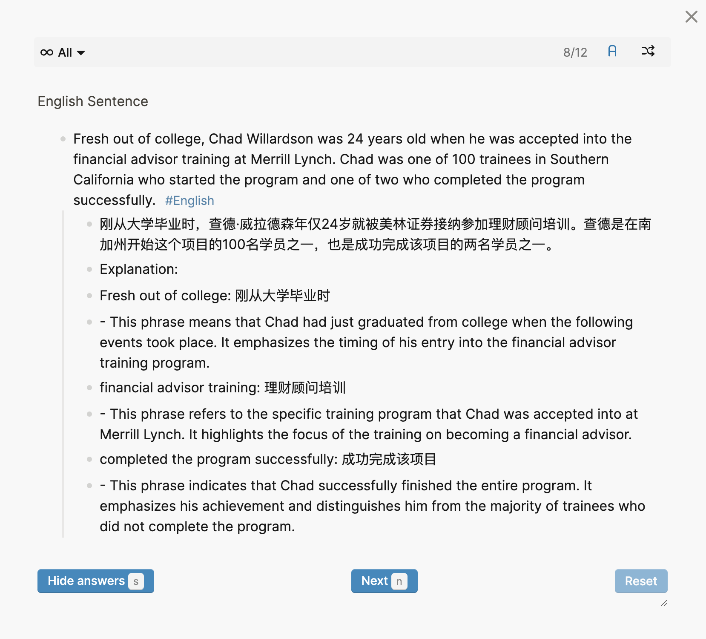

我的日常生活已经融入了很多 AI 的协助，比如翻译一段文字、解释某个名词、回答一个问题等等。但是频繁使用后发现了另一个问题就是这些 AI 的产出对我的知识来说是个有益的补充，可是使用的时候通常是一次性的解决问题，并没有把这些内容沉淀下来。当需要把他们收集到笔记里的时候还要再回去整理，很是不方便。想象一下，如果这些临时查询的宝贵信息可以自动保存到自己的笔记系统中，就再也不用担心丢失重要的知识片段了。于是就萌生了做个工作流把这些 AI 生成的内容自动存到我的笔记系统里，然后再定期回顾。这里会介绍我调研的一些工具的局限，以及如何用了一个简单的框架把 AI 生成的内容自动导入到 logseq，并做成 flashcard。

# 问题分解和初步调研

这里以我一个日常翻译的场景为例：当遇到读不懂的句子是我希望能够划词翻译，然后让 AI 帮我分析这个句子里疑难的单词，最后把这些内容以 flashcard 的格式保存到 logseq 里，这样借助手机端的同步我就可以在碎片时间来复习这个句子了。所以问题大致就是三个，1. 取出划线的文本 2. 编写一个 prompt 生成我想要的内容 3. 保存到 logseq。

前两步其实很多工具都已经集成了包括 Raycast AI 和 OpenAI-translator，但是第他们都没提供把前两步的结果导出到第三方的扩展接口。Raycast 理论上可以通过自己的插件体系来完成这件事，但是我这边不太熟悉 JS，并且也不想太依赖 Raycast AI，毕竟后面不打算续费了。于是决定自己写个 python 脚本做这些事，然后通过 Raycast 的 script command 和快捷键直接调用脚本，这样理论上也可以一个快捷键完成整个工作流。

# 如何获取划选的文本

第一个难题就是获取划选的文本，看上去是个操作系统级别的操作，并不是很好实现。直到我看到了一个查词软件的实现我才恍然大悟：

```bash 
# https://github.com/raycast/script-commands/blob/master/commands/apps/dictionary/look-up-in-dictionary.applescript
tell application "System Events"
    keystroke "c" using {command down}
    delay 0.1
    do shell script "open dict://" & the clipboard
end
```

这个脚本本质上是模拟键盘摁下了 `cmd + v`，然后直接读剪切板去了，就这么绕过了获取选中文本的问题。考虑到我在用 Raycast 的时候经常碰到划选的文本识别错误，已经养成了 `cmd + v` 的习惯，那就不用费劲心思找获取划选的文本的方法了，直接读剪贴板就完了。

# 调用 AI

这块基本经轻车熟路了，关键的是设置一个合适的 prompt，在翻译的同时生成一个句子的教学指南，并尽可能的按照 logseq 的格式来输出：

```python
message_text = [
    {
        "role": "system",
        "content": "You are a university English teacher, below is a paragraph in English. " +
        "Please first translate it into Chinese. Then extract difficult words and phrases from the source paragraph, sort them in descending order of importance choose only the top 3 output them with explain of their usage to me in detail from a linguistic perspective." +
        "The overall output should look like this: \n" +
        "- {The Chinese Translation} \n" +
        "- Explanation: \n" +
        "  - {word or phrase}: {explanation}\n"
    },
    {
        "role":"user",
        "content": content
    }
]
```

# 输出到 logseq

在输出到 logseq 这一步的时候本来是打算调用 logseq 的 API，logseq 的开发者模式提供了一个本地的 HTTP 服务可以通过 HTTP 去调用。但是当我看了他们的 API 文档后差点给整崩溃了，所有的操作都要用 id，page id 又没办法去直接索引，要 getAll 后自己过滤。appendBlock 也不允许插入带层级的 Block，要串好几个 API 才能完成一个简单的操作。

崩溃的时候转念一想，logseq 不就是一堆 markdown 的渲染器么，既然 API 那么难用我直接去写文件不就好了，于是一组复杂的 API 调用变成了轻松愉快的文件 append 操作。这样既绕开了 logseq API 的限制，甚至有可能接入其他基于 markdown 的笔系统。

最后完整的代码如下：

```python
import pyperclip
from openai import AzureOpenAI

content = pyperclip.paste()

azure_endpoint = "YOUR AZURE ENDPOINT"
api_key = "YOUR API KEY"
model = "YOUR MODEL NAME"
logseq_path = "YOUR LOGSEQ PAGE FILE PATH"

client = AzureOpenAI(
  azure_endpoint = azure_endpoint,
  api_key=api_key,
  api_version="2024-02-15-preview"
)

message_text = [
    {
        "role": "system",
        "content": "You are a university English teacher, below is a paragraph in English. " +
        "Please first translate it into Chinese. Then extract difficult words and phrases from the source paragraph, sort them in descending order of importance choose only the top 3 output them with explain of their usage to me in detail from a linguistic perspective." +
        "The overall output should look like this: \n" +
        "- {The Chinese Translation} \n" +
        "- Explanation: \n" +
        "  - {word or phrase}: {explanation}\n"
    },
    {
        "role":"user",
        "content": content
    }
]

completion = client.chat.completions.create(
  model=model, # model = "deployment_name"
  messages = message_text,
  temperature=0.7,
  max_tokens=500,
  top_p=0.95,
  frequency_penalty=0,
  presence_penalty=0,
  stop=None
)

if completion.choices[0].message.content == None:
    print("No response")
    exit()

response = completion.choices[0].message.content
print(response)

with open(logseq_path, 'a') as f:
    f.write("\n- " + content.rstrip() + " #card #English" + '\n')
    for line in response.splitlines():
        if line.startswith("```"):
            continue
        if line.rstrip() == "":
            continue
        if not line.startswith("- "):
            line = "- " + line.rstrip()
        f.write("  " + line + '\n')
    f.close()
```
后需要做的就是在 Raycast 里给这个脚本设置一个快捷键，这样下次碰到不会的句子，选中复制后就可以通过快捷键完成翻译，难点提取，和生成 flashcard 的整个工作流。

最后生成的 flashcard 效果大概如下：



# 总结

通过将 AI 生成的内容自动化集成到 Logseq 笔记中，我们不仅提高了信息管理的效率，还优化了学习和工作流程。通过一个简单的脚本每个人都可以轻松地将这种强大的技术整合到日常生活中，实现知识的积累和复习。