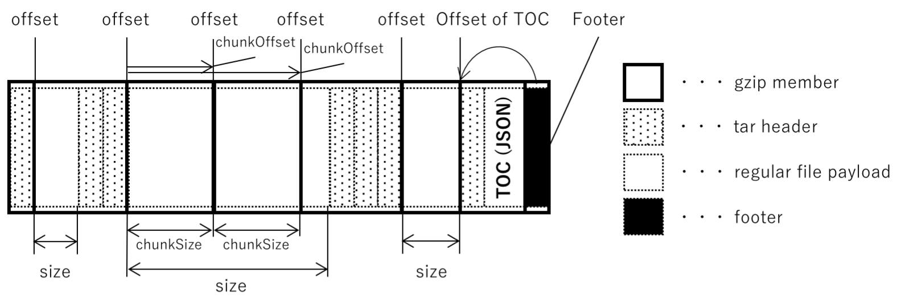
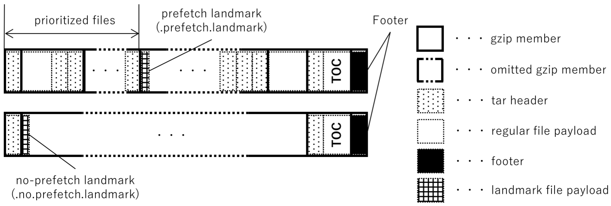
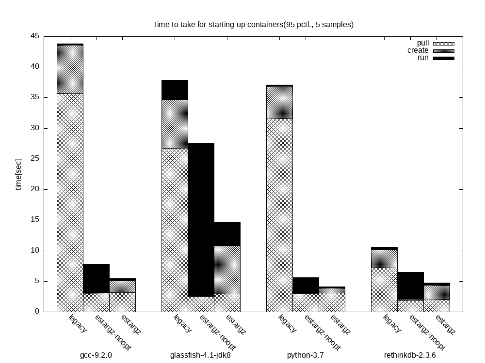

在容器的启动过程中，镜像下载速度往往是影响启动速度的最主要因素，通常占据了启动时间的 70% 以上。特别是对于体积庞大的 VM、AI 镜像，它们的大小可能达到数十 GB，导致下载和解压速度都成为启动的瓶颈。本文将探讨镜像下载的主要瓶颈、常见的优化方案以及最新的按需加载技术，以加速容器启动。

### 镜像下载速度慢的原因

容器镜像下载慢的原因主要有以下几点：

- **镜像体积过大**：VM、AI 镜像体积通常较大，可能达到数十 GB，使得下载时间显著。
- **gzip 解压耗时**：特别是在内网环境中，解压时间往往远高于网络传输时间，导致解压成为新的瓶颈。

### 常见的镜像优化思路

为了解决下载和解压的速度问题，业界提出了多种优化方案：

1. **镜像缓存**  
   镜像缓存是提升镜像下载速度的一种方法，通过缓存镜像可以避免重复下载。然而，缓存无法解决冷启动问题，并且镜像频繁变更（如应用更新或安全更新）会导致缓存失效。要实现高效的缓存管理，还需要较复杂的机制来管理缓存更新。

2. **减小镜像体积**  
   减少镜像体积也有助于缩短下载时间，但在某些场景下，例如 VM、AI、CUDA 镜像，体积优化空间有限。它们通常需要使用超过 7 GB 的存储空间，难以进一步缩减。

### 按需加载：是否可行？

目前，大多数容器在启动时并不需要完整的镜像内容。一些论文表明，启动期间仅需 6.4% 的镜像内容，因此理论上可以通过按需下载来优化启动速度。然而，现有的镜像格式存在以下问题，限制了按需下载的实现：

- **OverlayFS 的限制**：需要所有镜像层下载完毕后才能得知最终文件结构。
- **gzip 不支持随机访问**：即使只需下载单个文件，也要下载并解压整个层。
- **校验问题**：镜像 digest 是按整个层计算的，无法针对单个文件校验。

### eStargz：实现按需加载

为了解决上述问题，eStargz 提出了针对 gzip 层的优化方案，即每个文件单独压缩并增加文件级别索引。eStargz 引入了如下优化：

1. **独立压缩**：每个文件单独压缩并索引，解决了 gzip 无法随机访问的问题。
2. **文件校验**：可以对单个文件进行校验，无需校验整个层。

具体的存储格式如下图：



每个文件被单独压缩合并成一个大的 blob，在 blob 最后增加一个 TOC 的描述文件记录每个文件的偏移量和校验值，这样就实现了按文件的索引和校验。


以下是 eStargz 的 TOC 格式示例：

```json
{
  "version": 1,
  "entries": [
    {
      "name": "bin/",
      "type": "dir",
      "modtime": "2019-08-20T10:30:43Z",
      "mode": 16877,
      "NumLink": 0
    },
    {
      "name": "bin/busybox",
      "type": "reg",
      "size": 833104,
      "modtime": "2019-06-12T17:52:45Z",
      "mode": 33261,
      "offset": 126,
      "NumLink": 0,
      "digest": "sha256:8b7c559b8cccca0d30d01bc4b5dc944766208a53d18a03aa8afe97252207521f",
      "chunkDigest": "sha256:8b7c559b8cccca0d30d01bc4b5dc944766208a53d18a03aa8afe97252207521f"
    }
  ]
}
```

通过这种改进，eStargz 实现了对单个文件的按需加载，且可以实现文件级别校验。

### 性能权衡：优先级加载

虽然按需加载大幅优化了下载性能，但也可能带来运行时性能的下降。为此，eStargz 采用特殊标识来实现优先级加载，将启动所需文件放置于 `prioritized zone` 中，确保这些文件优先下载，进而提升运行时性能。



按照作者测试的性能表现如下：



### 代价与挑战

尽管 eStargz 带来了按需加载的性能提升，但也带来了以下代价：

- **存储空间增加**：每个文件单独压缩会增加额外的 metadata，降低压缩率。
- **额外插件支持**：eStargz 需要插件支持，例如在容器镜像推送和拉取时需要特定处理插件。

### 如何使用 eStargz

以下是 eStargz 的使用方法，适用于 containerd 的子项目以及一些支持 eStargz 的工具：

1. **Docker, kaniko, nerdctl 命令行参数**：

    ```bash
    docker buildx build -t ghcr.io/ktock/hello:esgz \
        -o type=registry,oci-mediatypes=true,compression=estargz,force-compression=true \
        /tmp/buildctx/

    nerdctl image convert --estargz --oci ghcr.io/ktock/hello:1 ghcr.io/ktock/hello:esgz
    ```

2. **containerd 插件配置**：

    ```toml
    version = 2

    [proxy_plugins]
      [proxy_plugins.stargz]
        type = "snapshot"
        address = "/run/containerd-stargz-grpc/containerd-stargz-grpc.sock"

    [plugins."io.containerd.grpc.v1.cri".containerd]
      snapshotter = "stargz"
      disable_snapshot_annotations = false
    ```

此外，GKE 等云平台的集群已默认启用类似方案，进一步加速了镜像启动速度。看阿里也发表了基于 block device 的按需加载，这类的实现看上去在云厂商都有了比较大规模的落地。

### 总结

从传统的镜像缓存、镜像体积优化，到按需加载，eStargz 提供了一种兼顾性能和灵活性的方案，使得容器可以在仅下载部分内容的情况下启动。

### 参考资料

- [eStargz: Standard-Compatible Extension to Container Image Layers for Lazy Pulling](https://github.com/containerd/stargz-snapshotter/blob/main/docs/estargz.md)
- [Startup Containers in Lightning Speed with Lazy Image Distribution on Containerd](https://medium.com/nttlabs/startup-containers-in-lightning-speed-with-lazy-image-distribution-on-containerd-243d94522361)
- [Slacker: Fast Distribution with Lazy Docker Containers](https://www.usenix.org/conference/fast16/technical-sessions/presentation/harter)
- [Accelerated Container Image](https://github.com/containerd/accelerated-container-image)
- [Use Image streaming to pull container images](https://cloud.google.com/kubernetes-engine/docs/how-to/image-streaming)