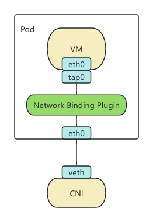

在 KubeVirt v1.4 的新版本里将 [Network Binding Plugin](https://kubevirt.io/user-guide/network/network_binding_plugins/) 提升到了 Beta，提供了一种新的扩展 KubeVirt 网络的方式。虽然名义上是为了扩展网络的能力，但实际上从实现上来看，这个机制能做的事情远不止网络，所有和 libvirt domain xml 相关的变更都可以通过这个机制来实现。

## KubeVirt Network Overview

先从网络的角度来看下 KubeVirt 之前的网络机制有什么问题，新的机制又是如何进行扩展的。

由于 KubeVirt 使用的是 Pod 里面跑 VM 的架构，所以复用了 CNI 的网络机制。这样的话就将网络分成了两个部分，一个是 Pod 网络由各个 CNI 提供。另一部分就是如何将 CNI 提供的网络接入 VM，在 libvirt 里这部分叫做 Domain 网络。

KubeVirt 之前的各种网络机制（Bridge， Masquerade， Passt， Slirp）所做的事情就是通过不同的技术方案将 Pod 里的 eth0 接入到 VM 的 tap0 网卡。例如 Bridge 将 tap0 和 eth0 接入到同一个网桥，Masquerade 将 tap0 的流量经过 iptables nat 规则导入 eth0，Passt 和 Slirp 通过用户态的网络栈做流量重定向。

这些方法在实现上都是类似的，在 Pod 内部做一些网络相关的配置，然后修改 libvirt 的启动参数接入对应的网络。但是现有的机制都是写死在 KubeVirt Core 里的，并没有扩展机制，想要新增一种机制或者修改已有的机制都需要修改 KubeVirt 的代码很不灵活，例如默认的 bridge 插件会劫持 DHCP 请求，但是又不支持 IP, 所以 bridge 模式下的双栈就很难实现，而 Kube-OVN 中已经实现的 DHCP 又被这个机制绕过去了，之前想做 bridge 的双栈就需要改 KubeVirt 的代码来关闭默认的 DHCP 十分麻烦。因此新版本中将这套机制抽象出来提供了一套通用的机制。

## Hook Sidecar

先来看一种在 KubeVirt 中已经存在的扩展机制 [Hook Sidecar](https://kubevirt.io/user-guide/user_workloads/hook-sidecar/)。

这套机制是在 VM 正式创建前，可以加载一个用户自定义的镜像，或者一段 ConfigMap 里保存的 Shell 或者 Python 脚本，来修改 VM 启动前 libvirt 的启动参数和 cloud-init 参数。

它的执行机制和 CNI 有些类似，virt-handler 在启动 VM 前会去对应目录寻找 `/usr/bin/onDefineDomain` 和 `/usr/bin/preCloudInitIso` 两个二进制文件，前者传入 virt-handler 生成的 libvirt XML 配置，返回修改后的配置；后者传入 cloudInit 配置，返回修改后的 cloudInit 配置。这样的话所有 KubeVirt 本身不支持的 libvirt 和 cloudInit 参数都可以通过这种机制来注入修改。并且由于 Sidecar 内实际可以执行任意代码，所能做的事情远不止修改这两个配置，所有初始化阶段 KubeVirt 没有实现的能力其实都可以在这里来实现。

## Network Binding Plugin

现在可以到 Network Binding Plugin 这个机制了，这个机制其实和 Hook Sidecar 基本上大同小异。主要区别是将二进制调用改成了 gRPC 调用，gRPC 里注册的方法还是  `onDefineDomain` 和 `preCloudInitIso` 参数传递从命令行参数改为了 gRPC Request 里的参数，其他都是一样的。

具体的例子可以参考目前还在 KubeVirt 代码里的 [Slirp Binding](https://github.com/kubevirt/kubevirt/tree/main/cmd/sidecars/network-slirp-binding) 的实现。尽管在 Network Binding Plugin 的规范里还增加了`networkAttachmentDefinition` 字段可以选择一个 CNI，但这个其实使用之前的网卡选择机制也能实现，甚至由于 Sidecar 里可以执行任意代码，在里面再实现一个 CNI 覆盖 Pod 原先的网络也是可以的。

那么之后的网络架构就变成了下图这样：

## 总结

虽然 Network Binding Plugin 的机制是为 Network 扩展准备的，但实际上几乎可以扩展所有 KubeVirt 在 virt-handler 侧的处理逻辑，甚至可以把 KubeVirt 也只当一个框架，所有的逻辑都通过 Sidecar 来处理，相信未来可以玩出不少花活来。

## 参考资料

- https://kubevirt.io/user-guide/user_workloads/hook-sidecar/
- https://kubevirt.io/user-guide/network/network_binding_plugins/
- https://github.com/kubevirt/kubevirt/blob/main/docs/network/network-binding-plugin.md
- https://github.com/kubevirt/kubevirt/tree/main/cmd/sidecars/network-slirp-binding