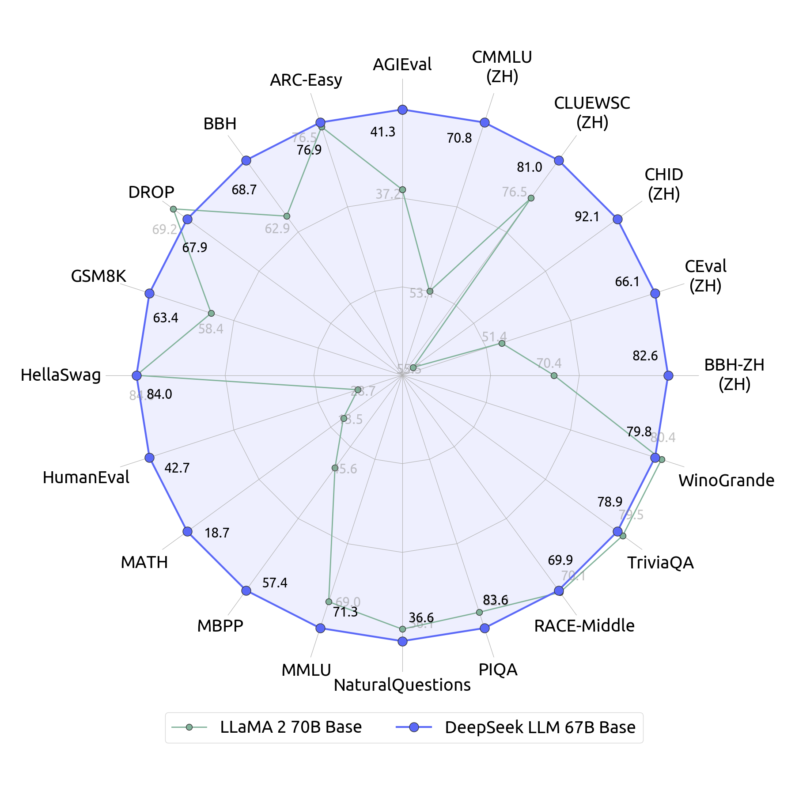

最近找到了 DeepSeek 发表过的论文合集，包含了从 DeepSeek 第一版的 LLM 到最新的 R1 的演变过程。从当下的角度我们当然知道 DeepSeek R1 在模型能力上已经接近了业界最领先的水平，但他是如何一步步从一个在中国一开始都没有被重视的量化公司走到这里的其实更吸引我的注意。

这个系列的博客我会从论文阅读的角度，试图去寻找他们一步步探索的轨迹，从论文的路径上来看就是 DeepSeek LLM -> DeepSeek MoE -> DeepSeek V2 -> DeepSeek V3 -> DeepSeek R1。在整理论文时我才发现，DeepSeek 第一篇对外发布的论文是在 2024 年的 1 月，当时他们刚发布第一版模型，即使在 AI 行业内也不被认为是个主要竞争者。然而仅仅一年后的 2025 年 1 月，就已经进化到了 R1 这种业界领先水平。都说 AI 一天，人间一年，但是当真看到人间一年的进展时，还是深深的被 DeepSeek 的速度所震撼。

## 背景

DeepSeek LLM 是 DeepSeek 开源的第一个 LLM，当时开源 LLM 里最受关注的是 LLaMA-2，很多模型也是基于它的架构和基础进行的。现在从后视的角度我们知道 DeepSeek 最终选择了和 LLaMA 这类 Dense 架构不同的 MoE 架构，但是在当时第一版的时候还是基本上照搬了 LLaMA-2 的架构，进行局部的调整。可以猜测当时团队内部还处于探索模型架构的阶段。

尽管架构大体和 LLaMA-2 相同，训练的数据量也都是 2T tokens，但是在性能评测上，如下图所示 DeepSeek LLM 基本上是全面超越了 LLaMA-2。论文里介绍了他们发现的一些有趣的关于数据，训练和微调的方法。

值得注意的是 DeepSeek 在训练过程中是可以使用更多的数据，使用更大参数量的模型的，显然这样做会提升模型性能。但是这篇论文目的主要是和 LLaMA-2 对比，因此特意把数据规模和参数量都做到尽可能相近，来比较在其他方面还有哪些地方可以提升。

## 数据

LLaMA-2 和 DeepSeek LLM 在数据的选择上还是有很大的区别的。虽然都是 2T 的 token 量，LLaMA-2 里接近 90% 的语料都是英文，而 DeepSeek LLM 虽然没有详细说语言的比例，但是看表述语料里的英文和中文比例应该是比较接近的。所以逻辑上来看 DeepSeek LLM 在中文的评测上大幅领先并不是个意外。意外的反而是在英文评测指标上，DeepSeek LLM 在训练量明显少的情况下依然取得了接近的性能结果。

我猜测这种现象的原因有两个，第一是 DeepSeek LLM 的语料质量更高，弥补了数量上的劣势。LLaMA-2 在介绍预训练语料的时候说除了一些敏感信息没有对数据集进行过滤，而 DeepSeek LLM 中介绍了为了提高数据质量专门做了模型去评估数据质量，还特意把一些冷门领域的数据占比放大，已获得更好的数据多样性。因此可以推测英文部分的语料质量 DeepSeek LLM 要高一些。作为参考 LLaMA-3 也在数据准备过程中引入了去重和质量过滤来提升语料的质量。

另一个原因我猜大概是中文语料的引入也提升了模型最终在英文上的表现。OpenAI GPT 3.5 的时候训练语料也是英文为主，但是最终在中文的表现上不差，一个猜测的原因就是在英文语料上学习到的一些知识迁移到了中文。同样中文语料里学习到的一些知识也可以迁移到英文。此外由于中文和英文在语法和表现形式上也有比较大的区别，这种多样化的数据是不是一定程度上也提升了模型的能力？还有就是不同语言本身就有不同的文化背景和内容倾向，这其实也是进一步增加了数据的多样性。如果这个猜测成立的话，那准备语料其实应该刻意地去增加不同语言的比重，让模型可以学习更丰富的语言表达形式。

## 模型架构

模型的架构层面 DeepSeek LLM 和 LLaMA-2 几乎完全一样，各个路径上用到的技术比如 Pre-Norm，FFN 的激活函数，位置编码器都一模一样。最大的区别在于使用 GQA（Group 
Query Attention）上。GQA 相比最原始的 MHA（Multi Head Attention），可以理解为为了节省训练和推理的 kv cache 占用，直接让多个 Query 头共享一组 Key 和 Value 的参数矩阵，这样可以大幅压缩显存的使用。但是带来的问题就是减少了 Key 和 Value 的潜空间个数，模型的表达能力也出现了下降。LLaMA-2 的做法是通过增加 FFN 网络的宽度来提供更多的非线性表达能力，而 DeepSeek LLM 的做法是增加 Attention 的层数。可以粗略理解尽管模型参数量相同，但是 LLaMA-2 是一个更宽的模型，而 DeepSeek LLM 是一个更深的模型。

另一个区别在于 LLaMA-2 使用的是 cosine learning scheduler 而 DeepSeek LLM 使用的是 Multi-Step learning scheduler。给出的理由是当增加数据量的时候，Multi-Step 可以更好的利用前一阶段的结果，持续训练速度会更快。

此外论文里还花了很大篇幅来介绍如何在不同的数据规模，数据质量，模型规模下选择合适的超参，如何去画 scaling law 曲线。这块是作者当成最大亮点来讲的，但是我看上去感觉和炼丹一样，看的我脑壳疼，感兴趣的同学可以自己看看。

## 后训练

在论文发表的那个时间点，后训练主要是做对齐，也就是通过 SFT 和 RLHF 来对齐人类的偏好，增加模型的安全性。用到的数据基本上也都是一些带标记的对话文本，并没有对数据的分布做特别的处理。DeepSeek LLM 在这里对数据的选择又做出了和 LLaMA-2 很不一样的选择。

如果看最上面模型性能评估的对比图，可以看到 DeepSeek LLM 在 MATH，HumanEval 和 MBPP 几个非中文的指标表现也要好很多。因为 DeepSeek 在后训练的 SFT 阶段将近 70% 的样本都是 Math 和 Code 相关数据。可见他们根本就没把对齐作为后训练的重点，而是把提升模型能力作为后训练的重点，所以这更像是一个鸡贼的刷榜优化。

当时主流的做法还是在 base model 训练好了后再 SFT 一个代码和数学领域的模型，比如 Code LLaMA  和 OpenAI Codex 是分别在 LLaMA-2 和 OpenAI GPT3 上 SFT 出来的。Meta 当时甚至还在 Code LLaMA 上再 SFT 一个 Python 专用的 LLM 出来。

现在我们当然知道在后训练阶段通过在 Math 和 Code 样本上进行 RL 可以激发出模型 CoT 的推理能力，R1 的想法可能在这个时候就已经诞生了。

此外 DeepSeek LLM 在这里并没有用当时很流行的 RLHF，而是选择 DPO(Direct Preference Optimization) 进行和人类偏好的对齐。这种方法直接对两个不同生成结果的概率差作为优化目标进行训练，这相比 RL 其实更直观也更容易设计。在 LLaMA-3 的后训练过程中也用到了 DPO。

## Future Work

在我上学的时候，老师和我说真正的 Future Work 不要写在论文里，自己偷偷做再发下一篇，论文的 Future Work 里就写你觉得没戏的和你觉得做不出来的。而 DeepSeek LLM 最后 Future Work 的几句话从现在的视角来看都太真诚了，几乎已经把 R1 的路子给指出来了。

> DeepSeek LLM 将会是一个长期项目，专注于促进开源模型进步，

这个不好说，毕竟满打满算也就一年多。

> Soon，我们将会发布 Code 和 MoE 架构的技术报告。MoE 的架构看上去很有希望。

这个 Soon 指的是一周发布 MoE，半个月发布 DeepSeek Code。而我们已经知道 MoE 成为了 V2，V3 和 R1 模型的基础架构，参数量也上升到了 671B。

> 我们现在已经有了大得多质量好得多的数据集，下一代模型所有指标都会显著提升。

数据量半年后从 2T 变成了 8T，不过同期 LLaMA-3 变成了 15T。DeepSeek V2 的各项指标相比同期的 LLaMA-3 在英文上是稍微落后的，而且在 V2 的时候他们的重点就已经变成了疯狂降低成本。

> 我们的对齐团队发现强化学习能够增强模型的复杂推理能力。

从今天回头来看，这不就是 R1 最重要的方法么。

## 总结

从今天的视角来看，DeepSeek 当时应该还在探索期，还在和业界的开源模型对齐，还做了很多理论上的研究。但是从论文的各个细节上来看，一年后那个石破天惊的 R1 诞生的条件已经差不多具备了。