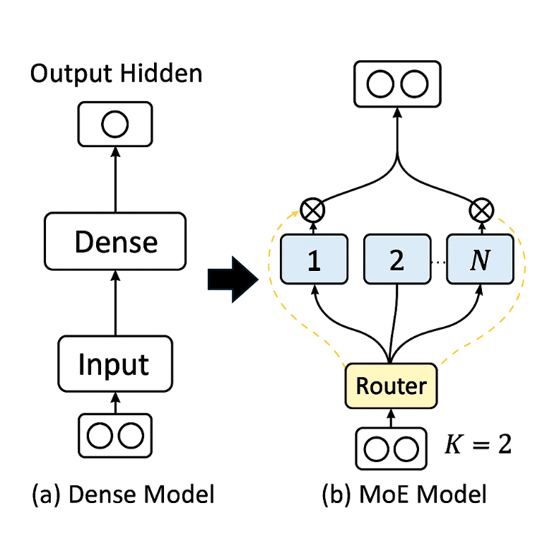
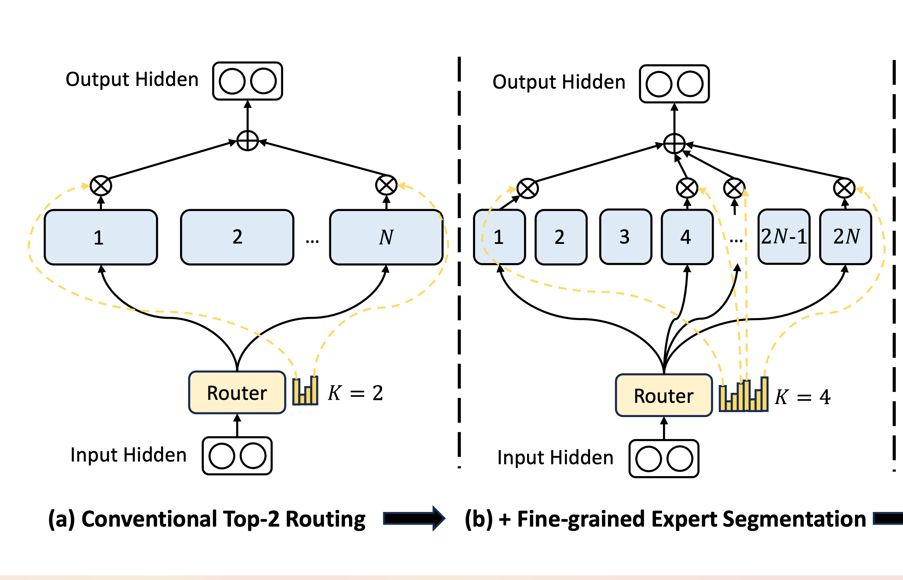
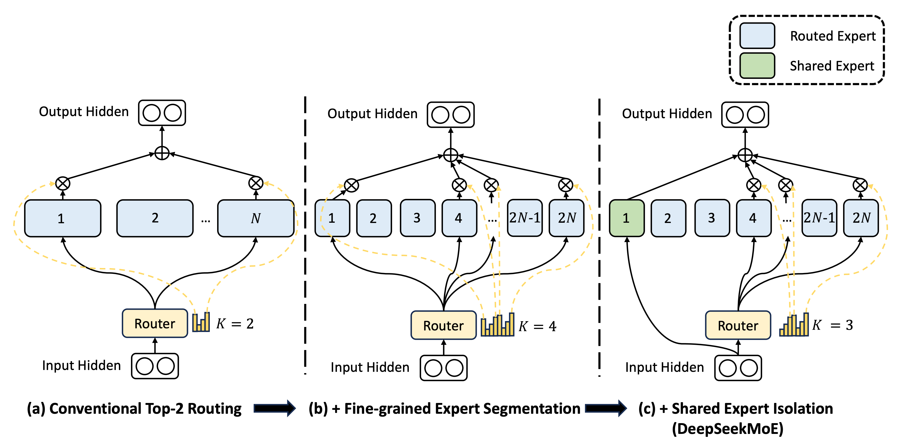
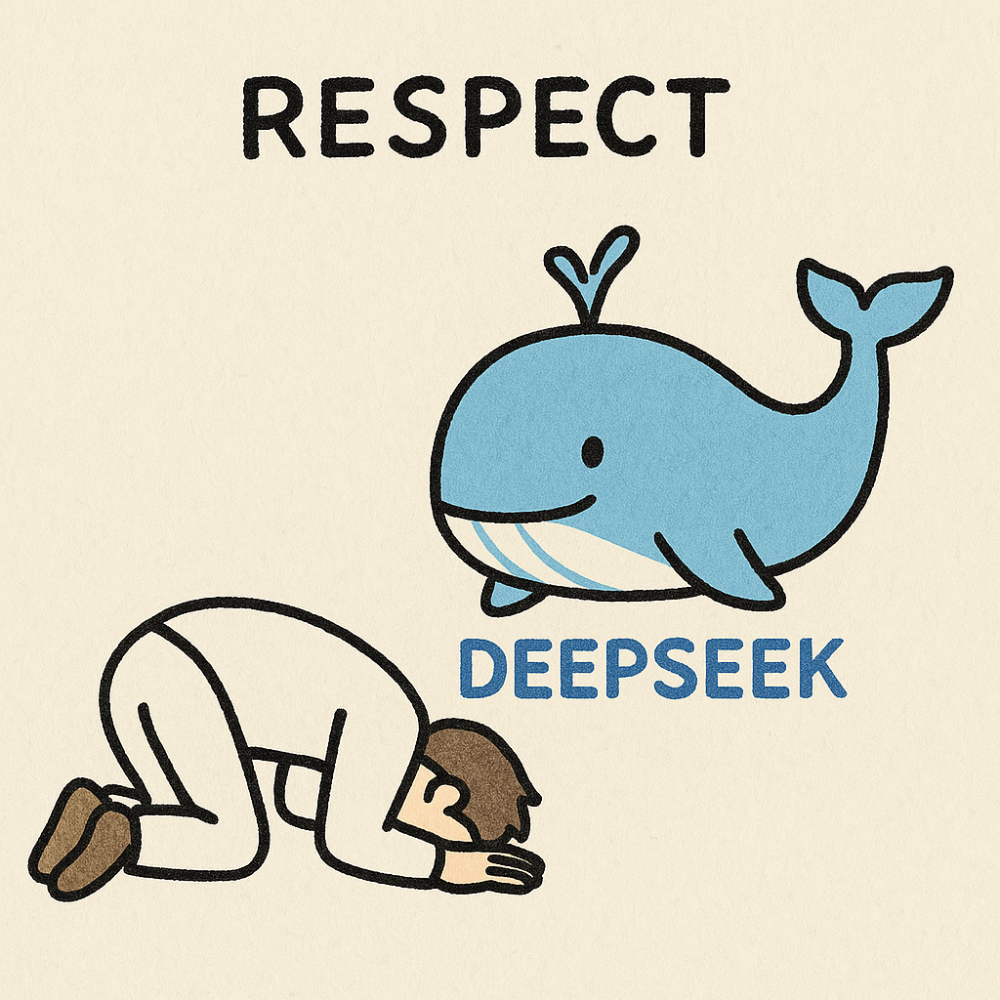

从 DeepSeek V3/R1 开始关注 DeepSeek 工作的人很容易认为 DeepSeek 大量的工作都是在工程上优化效率，但是回看 DeepSeek 过去一年的论文才会发现他们其实一直在模型架构和训练方法上做各种创新，而 V3 和 R1 只是在之前架构创新的基础上进行 Scale。DeepSeek MoE 这篇论文就介绍了 DeepSeek 在 MoE 架构上的主要创新，现在看上去也很有希望成为未来 MoE 架构的标准。

## MoE vs Dense

先说一下 MoE 和传统的 Dense 架构的区别。早期的 LLM 基本都是 Dense 架构，也就是每生成一个 Token 需要激活所有的神经元参与计算，这种方式其实和人脑的思考方式是有很大区别的，人脑是不会任何问题都需要调动所有脑细胞的，如果这样的话人早就累死了。所以很自然的一个想法就是生成 Token 的时候不要再激活所有的神经元了，每次只激活和当前任务最相关的神经元，于是就有了 MoE(Mixture of Experts) 架构，把 LLM 里每一层的神经元分割成 N 个 Expert，通过 Router 去选择 K 个最相关的 Expert 激活。

这个架构的好处就是在推理的时候不需要激活所有的神经元，计算量会大幅下降。在 DeepSeek MoE 前最常见的 8 选 2 模式下计算量可以下降到接近 Dense 模型的三分之一。

MoE 的架构看上去很理想，但本质上是在用少量 Experts 来模拟 Dense 模型的表现，所以关键是在每个 Expert 是否有足够的专业性，能否真的模拟 Dense 模型的表现。如果类比人脑，当神经元足够特化时，特定任务只需要激活少量神经元即可完成。

DeepSeek MoE 这篇论文就介绍了他们为了把每个 Expert 专业性推到极致所做的两个创新：
- 更多更小的 Expert
- 知识共享 Expert
## 更多更小的 Expert

使用更多更小的 Expert 来增加每个 Expert 的专业性看似是个很符合直观的思路，但是之前主流 MoE 都是 8 个或者 16 个 Expert。可以想象 LLM 要处理的问题类型千千万，这个数量规模的 Expert 显然不可能做到高度的专业化，每个 Expert 都会有大量当前任务无关的知识。

但是随着 Expert 的数量变大，训练的难度也会变大，Router 很容易只选择少数几个 Expert 导致负载的极度不均衡。最终，理论上的 MoE 架构可能会变成每次只激活同一组 Expert 的小模型。因此，之前大部分 MoE 架构的 Expert 数量都不会太多。

DeepSeek 经过一组设计的损失函数，给重复选择同一个 Expert 增加了惩罚，从而迫使 Router 更均衡的去选择 Expert。通过这个方式 DeepSeek 解决了训练的问题，开始一步步尝试 scale Expert 的数量。从这篇论文里的 64 选 6，扩展到 128 选 12，到 V2 的 160 选 6，再到 V3 的 256 选 8。

可以看到 DeepSeek 一步步将 Expert 数量扩展，而且所需要选中的 Expert 比例也从 9% 一步步降低到 2%，证明了确实在 Expert 足够专业化后只需要更少部分的激活就可以完成对应的任务。

## 知识共享 Expert

随着 Expert 变小和 Expert 数量增加其实还会带来另外一个问题，那就是每个 Expert 除了需要特定领域的知识外，其实还需要一些通用知识，例如一些通用的语言理解和逻辑分析，可能是每个 Expert 都需要的。如果每个 Expert 都记忆了相关知识那么其实会造成大量的知识冗余，当 Expert 数量变多时，问题会更加明显。这其实会限制每个 Expert 的专业化，训练和推理过程中也会造成资源的浪费。

DeepSeek 提出的做法是增加一组共享 Expert，这一组 Expert 每个训练样本都会被激活，希望他们在训练过程中可以学到通用的知识，这样其他的 Expert 就无需再去学习这些通用知识，只需要学习专业知识了。当推理过程中这组共享 Expert 也会每次都被激活，来提供通用的知识信息。

这同样是一个很符合直觉的架构创新，但是由于之前 MoE 架构的 Expert 规模本来就不大，这个优化的意义其实并不明显，只有当规模上去了这个问题才会暴露出来。在这篇论文里 DeepSeek 还根据 Expert 数量按比例扩充了共享型 Expert 数量，但是随着更多的训练和实践，发现其实并不需要那么多共享型 Expert，等到 V3 的时候其实只使用到了 1 个共享型 Expert。

## 感想

看完这篇论文我最大的感受是 DeepSeek 并不是拿一个已经验证过的架构无脑堆数据，而是真正的在做模型层面的创新。这也导致在 V3/R1 大火之后很多框架第一时间都无法运行 DeepSeek 的模型或者性能也很差，因为 DeepSeek 的模型架构和其他人都有明显的差别。

并且相比 DeepSeek 其他论文里提到的 MLA、GRPO 和 NSA 这些需要复杂数学功底的创新不同，这两个模型创新都还是相对符合直觉的，但在那个时间点只有 DeepSeek 敢于这么尝试，其他人还在 Follow Llama 的 Dense 模型，敢于去做非主流的尝试，还是需要很大的勇气，这里只能对 DeepSeek 团队再次表达 Respect。

