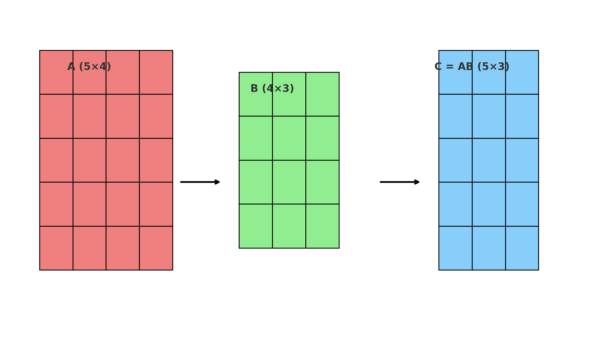
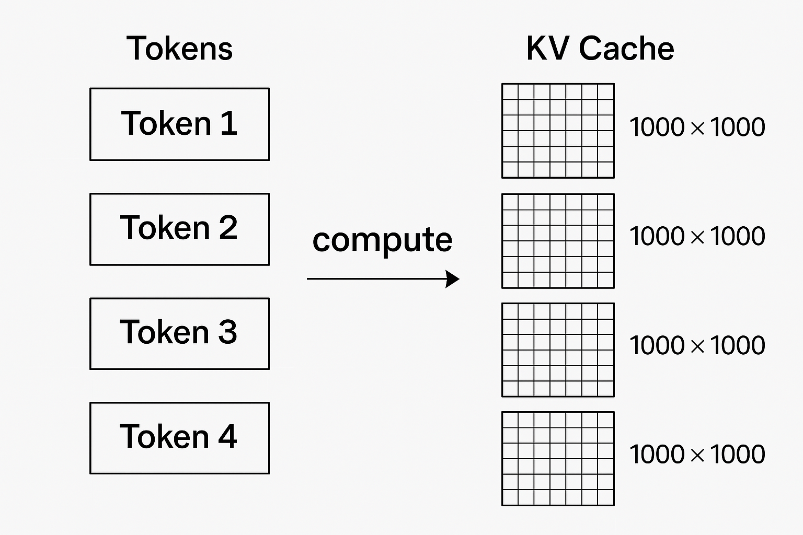
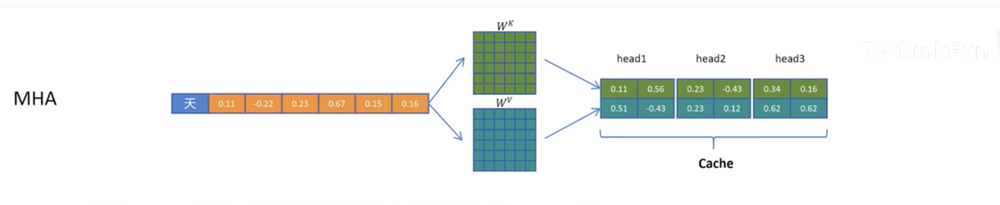
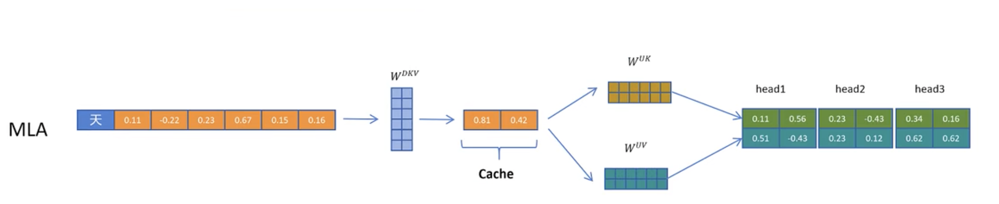
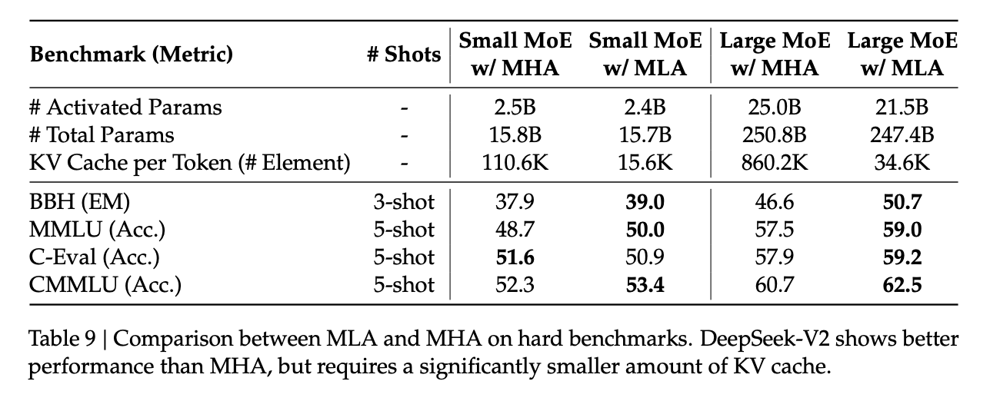

DeepSeek 第一次出名是因为 DeepSeek V2 做到了一百万 Token 只要 0.14 美元。同期的 GPT-4 是 30 美元，当时被认为极具性价比的 GPT-3.5 也要 1.5 美元。这个突破性价格的出现在国内引发了一轮价格战，大批大厂模型大幅降价甚至免费。然而和其他大厂烧钱补贴的逻辑不同，DeepSeek 是通过一系列的技术创新实现了成本数量级的下降。这篇文章就来介绍一下这背后最关键的一个技术创新 —— MLA(Multi-Head Latent Attention)。

MLA 最本质的数学技巧并不复杂，论文里也是一段话就说完了，看完让人感叹竟然还有如此精妙的解法。但是由于和整个 Transformer 架构耦合会导致理解起来有些困难，我这里会尽量简化描述，哪怕你之前完全不了解 Transformer 应该也可以领会到这个方法的精妙。

当然还是需要有一些线性代数的基础，如果你还记的一个形状为 5\*4 的矩阵乘形状为 4\*3 的矩阵，结果是一个形状为 5 \* 3 的矩阵就可以继续了。

## KVCache

大模型推理的成本的瓶颈在哪里？答案可能会出乎意料 —— 是显存。显卡有大量计算单元，而推理任务又是线性的一次只能出一个 Token，为了充分利用显卡的计算资源达到最大的吞吐，一般会同时运行尽可能多的生成任务。而每个任务在推理过程中都会占用大量显存，如果想运行尽可能多的任务就需要运行时显存占用足够小。而 MLA 在运行时的显存占用是原始注意力机制的 **6.7\%**，你没看错，不是降低了 6.7%，是降低了 **93.3\%**。打个比喻这一刀下去不是腰斩，而是脚踝斩。在不考虑模型本身的显存占用情况下，近似可以认为 MLA 在相同显存下可以容纳 **15 倍**的生成任务。

虽然 MLA 的论文里没有细说这个灵感的来源，但我认为他们是从原先的 KVCache 倒推，诞生了一种全新的注意力机制。到这里就不得不说下 KVCache 是什么。

大模型每生成一个 Token 都需要对之前所有的 Token 进行计算，来得出最新的一个 Token 是什么。但是一般任务不会生成一个 Token 就结束，往往要一直生成到结束符号，这就会导致前面的 Token 每一次都要重复计算。于是 KVCache 的作用就是把之前每个 Token 计算生成的中间结果保存下来，这样就可以避免重复计算了。你可以理解为每个 Token 都被映射成了一个 1000 \* 1000 的矩阵，那么我们有没有什么办法来减少这个矩阵的内存占用呢？

## MLA

这里有意思的事情终于可以开始了，我们可以用两个小矩阵相乘来近似一个大矩阵。这里刚才你还记得的线性代数知识可以用上了，1000 \* 2 的矩阵乘一个 2 \* 1000 的矩阵也可以得到一个 1000 \* 1000 的矩阵，而这两个矩阵总共只有 4000 个元素，是 1000 \* 1000 矩阵元素数量的 0.4%。

这就是 MLA 在数学上最核心的思路了，在 DeepSeek V2 中，本来一个 Token 应该被映射为一个 1\*16k 的向量，而在使用 MLA 后会先通过一个压缩矩阵将这个 Token 映射为 1\*512 的向量，等到需要的时候再通过一个 512 \* 16k 的解压矩阵还原成 1\*16k 的向量。在这里压缩矩阵和解压矩阵都是通过训练得来，是模型的一部分只会占用固定的显存，而运行时针对每个 Token 的显存占用就只剩这个  1\*512 的向量，只有原来的 3%。

一个完整的对比如下图所示，原先的 MHA 需要 Cache 完整矩阵，而 MLA 只需要 Cache 中间压缩后的一个向量，再还原出完整矩阵。

这一切真的这么美好嘛？让我们想想 KVCache 的最初目的是什么，是为了减少 Token 的重复中间计算，MLA 虽然压缩了 KVCache，但是每次还需要一个解压操作，计算量又回来了。

这里就是一个更精彩的故事了，按照 Transformer 的计算，中间的 Cache 乘一个解压矩阵后还要再乘一个输出矩阵得到最终的结果，可以粗略理解为最终计算的公式是 Cache * W解压  * W输出 ，根据矩阵计算的结合率，可以先计算后两个矩阵的乘积，将后两个矩阵融合乘一个新的矩阵。由于 W解压  和 W输出 在训练后是确定的，因此做个简单的后处理把这部分提前算出来就好了。作者在论文中也用 **Fortunately** 来形容这件事情。

也就是说我们最初是出于压缩 KVCache 的思路去做了压缩和解压，但在实际推理过程中根本不存在解压的过程。在大幅压缩了显存的同时由于过程中的矩阵都变小了，推理所需的计算量也变小了。
## 模型能力

但在这里我其实还有个疑问没有解开，本质上 MLA 是用两个小矩阵相乘得到一个大矩阵，但是并不是所有的大矩阵都能完美分解成两个小矩阵。MLA 实际的搜索空间是小于 MHA 的，理论上来讲 MLA 的模型能力应该更弱。但是按照 DeepSeek 论文里的评测，MLA 的模型能力是要略强于 MHA 的。

这个事情其实就不太好理解了，我倾向于认为 MLA 虽然搜索空间降低了，但是最优解的概率反而变大了，收敛到了一个相比 MHA 更优的解。另外虽然 MLA 的优化是从 MHA 出发，但最终的结果其实是一套全新的注意力机制，模型的架构都发生了很大的变化，或许 DeepSeek 真的发现了一个更有效的注意力机制。

## 总结

有不少性能优化方案其实是在玩跷跷板游戏，比如用 GPU 计算时间交换显存空间，或者牺牲模型能力来换成本下降。而 MLA 在把显存打脚踝斩的情况下同时还做到了计算需求下降和模型能力提升，简直匪夷所思。

另一个感触是在经历了国内移动互联网时代的我们很容易认为价格战就是要赔本赚吆喝，却忘了技术创新才应该是那个最大的杠杆。

> 这篇博客只是介绍了 MLA 最核心的理念，在实际应用中还有很多具体的问题，例如：如何处理旋转位置编码？K 和 V 的解压矩阵融合其实略有不同，一个是直接应用结合律，一个是转置后再结合，等等。还是建议大家阅读 DeepSeek V2 的原始论文，有这篇文章做基础应该容易理解很多。
> 
> 博客里部分图片源自 [DeepSeek-v2 MLA 原理讲解](https://www.bilibili.com/video/BV1BYXRYWEMj/),也建议大家看下这个视频。