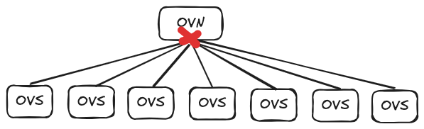
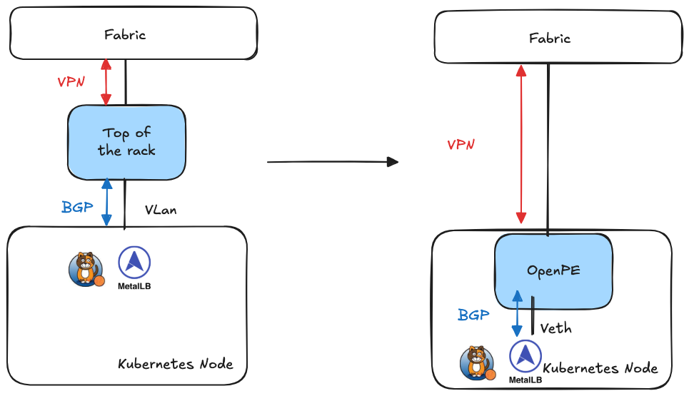

目前社区在 Kubernetes 实现网络多租户主流选型是 [Kube-OVN](https://github.com/kubeovn/kube-ovn) 和 [ovn-kubernetes](https://github.com/ovn-kubernetes/ovn-kubernetes)，这两个方案本质上都是在物理网络上通过 OVS 和 OVN 的能力构建了一层 Overlay 虚拟网络。这种方案不太关心底层物理网络架构，有着比较好的兼容性，但是双层网络架构也加大了整体架构的复杂度。

最近我在调研 EVPN 这种物理网络多租户的方案，发现了 [OpenPERouter](https://github.com/openperouter/openperouter) 这个开源项目，他把 EVPN 的理念引入了容器网络，提供了一种新的在 Kubernetes 上实现多租户的方案。该方案不仅能统一软硬件网络架构，还在一定程度上能兼容现有 Calico 这种通过 BGP 方式发布路由的 CNI，我甚至已经看到通过少量工作就可以让 Calico 具备多租户能力的前景。虽然这个项目还在早期，但我认为这是一个相当不错的方向，未来很可能会成为构建大规模数据中心的一个有竞争力选型。

## OVN 类方案的局限性

OVN 类方案的主要局限性有两个一个是集中式控制平面的规模限制，另一个就是网络复杂度。

## 集中式控制平面

尽管 Kube-OVN 在社区已经存在了上千节点的大规模案例，但是由于 OVN 这种集中式控制面的架构，会导致控制面存在比较大的压力，成为整个集群的瓶颈。特别是在控制面节点断电或者故障时，可能会需要较长时间网络控制面才能恢复。

这个问题主要是由 OVN 集中式控制平面的架构带来的，无法完全规避。ovn-kubernetes 中采用了每个节点一个 OVN 控制平面，多节点之间通过 OVN-IC 互联的方案来规避这个瓶颈。但是这个方案同时也会导致架构的复杂，并且相当于主动弃用了 OVN 本身的集群网络能力，使得大量的 OVN 能力无法使用。

## 网络复杂度

另一个问题就在于 OVS/OVN 这套体系本身的复杂度，使用者需要重新再构建一套 OVN 规范下的网络拓扑，流表的知识体系才能保证自己面对实际问题时不会手足无措。而这套体系和底层的物理网络往往又是不同的，实际中相当于存在两套网络体系，这不仅会使问题排查变得更复杂，还会导致需要物理网络团队和容器网络团队两套人马，双方往往都无法理解彼此的工作内容，无法有效协同。

以上两个局限性更多的是选型上的取舍，如果希望能够软件集中控制，希望容器网络能不关心底层物理网络，那这样的选择必然就会带来这样的局限性。

## EVPN

在和 OVS 这种纯软件方案平行的另一个硬件世界，有另一套硬件版本的多租户网络方案，那就是 EVPN。

在 EVPN 的世界里，在数据平面交换机之间通过 Vxlan 对数据包做封装，通过在 Vxlan 的 Header 中设置 VNI 来区分不同租户的流量，实现了流量的隔离。

同时，交换机之间通过 BGP 在控制平面来同步 L2/L3 的路由以及 VNI 的信息，能够快速的学习整个网络拓扑中的地址，路由和租户信息。 

通过这种方式，大型数据中心可以自动化分布式的实现多租户网络。这套方案在很多大型数据中心都已经落地了，主流的交换机目前也都已经支持。那么在容器领域有没有基于这种技术架构做网络的呢？这就是我最近发现的 OpenPERouter 了。

## OpenPERouter

OpenPERouter 的核心理念是将 EVPN 交换机的逻辑下沉到节点，在每台机器上运行一个 FRR 通过直接和物理交换机建立 BGP 和 VXLAN 隧道，将容器网络直接打通到已有的 EVPN 架构的物理网络。

现有的容器网络想接入 OpenPERouter 也并不算复杂，基于 BGP 的 CNI 需要和 OpenPERouter 建立 BGP Peer；对于基于 veth 和网桥的 CNI，需要把原来在宿主机一侧的 veth 改为接入到 OpenPERouter 所在的 net ns 即可。

这个方案带来了一些独特的优点：
1. 统一了底层网络和容器网络，两者采用了相同的 EVPN 架构，虽然在具体操作，软件使用上还有区别，但整体的思路已经基本一致了。
2. 极其轻量的方式就实现了 Underlay 和多租户这两个在容器网络里比较困难的功能，由于主要的控制面和数据面都在硬件层，容器网络只是做接入，理论上 CNI 层可以做的十分轻量化。
3. 可以将已有的 CNI 转换为多租户的 CNI，尽管项目的开发者没有具体提这个事情，但是我已经看到了给 Calico 的 IPPool 增加一个 VNI 的配置就能快速把 Calico 改造成一个多租户网络的可能性。

当然这个方案当前也有它的局限性：
1. 统一的网络也就意味着容器网络完全侵入了底层物理网络，这需要有统一的团队管理，这在当前的环境可能会产生很多办公室政治问题
2. OpenPERouter 目前自己并没有做 CNI 相关的事情，而是尝试接入其他网络项目。这可能是考虑到当前已有多种主流方案可供选择，但从我来看接入其他 CNI 反而会让这个简洁的 EVPN 方案变的比原来更复杂，未来发生不兼容和冲突也是大概率事件。基于这个思路从头做一个轻量化的专门面向 EVPN 设计的 CNI 会是个更优雅的选择。

## 小结

在我看来，EVPN 会是未来容器网络里的一个极其有竞争力的技术方案，但是当下并没有很成熟的开源项目，OpenPERouter 做了很好的尝试，我也很希望看到未来有一款专门为 EVPN 架构设计的 CNI 能够大幅简化全局的网络设计。