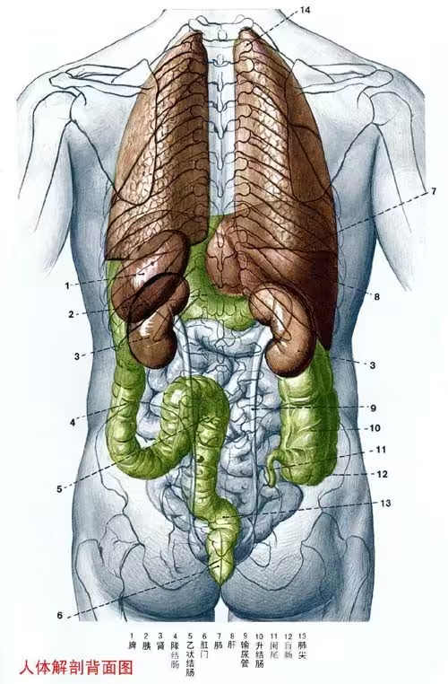

最近一周基本都在和肾结石作斗争了，记录一下过程，有想体验的小伙伴可以来看看。

## 肾的位置

这次肾结石的前两天我一直以为是深蹲拉伤，主要原因是我对肾的位置理解一直是错的。我一直以为肾是在下腹部的位置，其实后背部肋骨下方就是了。之前看人体器官图几乎从来没看过背面，但凡看过就能发现后腰从上到下只有一个泌尿系统，但凡后腰疼大概率是肾的问题。

## 从开始到 120

上周五的时候站着站着毫无征兆的腰就感觉和被扎了一下疼起来，当时就直接倒在床上吱哇乱叫了，从肋骨下方一直到骨盆半个腹部都开始抽搐起来，时间持续了大概五分钟才慢慢消失。现在想来应该是肾结石刚脱落，一下子卡到输尿管了，没卡住一会儿又掉回到肾里了。

好了之后发现一旦坐起来或者走一会儿路就会再这么来一下，躺着不动就没事，人就不敢动了，就按腰部拉伤来处理了。静养了一天感觉还不错，周日的时候觉得差不多了，就开始不怎么躺着了，结果一下来了个大的。

这次是坐着的时候感觉有点不舒服就躺下去了，然后疼痛不断升级，半个腹部感觉都拧在一起，接下来半边身子都麻了，舌头都动不了只能靠嗓子发声，然后另半边身子也开始发麻，眼睛里都是星星，眼看整个人就动不了了。而且这次完全没有消退的迹象，第一波刚好了一点还没缓过来第二波就又来了，每次都是半个腹部扭在一起全身发麻，一波一波的连绵不绝。我一度担心自己会不会半身不遂，疼的开始想生死的问题了，十来分钟后果断叫 120 把自己搬走了。

现在想起来应该是前几天活动比较少，肾结石都是刚卡到输尿管就掉下来了，周日活动多了一些彻底卡进输尿管掉不回去了，所以就一直疼下去不可能再恢复了。

我们这边是老小区，机动的救护车还比较多，感觉十分钟都没有救护车就到了，说一下你要去哪个医院就行，感觉和打车也差不多。

## 确诊

由于一开始我一直以为是锻炼拉伤，直接去了骨科，大夫觉得我疼的位置不太对转到了胸外科，胸外科拍了个 CT 大概两个小时出了结果，发现肋骨没问题，但是扫到了肾说是能看到有两个结石，于是把我转到了泌尿科。

由于我当时对肾的位置还有理解错误，还纳闷肋骨扫描怎么能扫到肾，想自己借着 AI 看 CT 结果，发现 CT 拍了 600 多张片子于是作罢。

泌尿科开了个腹部 CT 、血常规和尿常规，结果就是白血球高有炎症，尿红蛋白高有血尿，左侧输尿管卡了一个 6 毫米一个 4 毫米两块结石。由于 6 毫米是自然排出上限，大夫的建议是先等自然排出，一周后还有症状的话再看是超声波碎石还是微创手术取出来。

最后就是开了止疼药和消炎药，让我多喝水多蹦，疼的受不了就吃止疼药，一周后再看。我看有的疼痛等级指数介绍肾结石已经是最高级了，能和自然分娩坐一桌，想到可能还有一周整个人是崩溃的。当时都想直接去手术取出来了，不过想了想手术还是有创伤，理智战胜了冲动，还是打了针止痛回家了。

## 恢复

由于结石已经卡住了，不疼是不可能了，我发现蹦跶一阵疼痛会缓解一些，就只能在疼痛刚起来的时候赶快去蹦一阵，不然一旦疼劲上来就又动不了了。整个晚上基本上就是疼的时候就赶快去蹦，不疼了就闭眼躺一会儿，等再疼了再去蹦，最后到四点后才睡了一会儿，六点多疼起来就是循环继续。

这个过程中应该是结石划伤了输尿管伴随着炎症开始低烧，由于排尿管被堵住了明显感觉排尿偏少，而且肚子里有一大坨水，蹦的时候能感觉甩来甩去。

这样蹦了两天感觉疼痛点从肋骨慢慢往骨盆转移了，然后就不会那么疼了，但是还会有一波波的酸痛，应该是伤口被摩擦的感觉。蹦了两天后，基本也抬不起脚了，发烧和没睡觉的乏力感也上来了，后面两天一直在睡觉，等到这个周五的时候才基本不疼了，排尿也基本正常，肚子里也没一大坨水了。下周约个时间去医院再做一次 CT 看看结石是排出去了还是掉到膀胱里了，还有没有其余的没脱落的结石。

## 成因？

这次肾结石后立刻就老实了，我是从来没想到过可以这么疼。查了一些资料，主要原因应该还是喝水太少了，尿液沉积形成的。其他一些可能的诱因有含糖饮料可能会提升尿液浓度，可乐里的磷酸（有糖无糖都含有）会导致磷酸盐析出，茶叶里的草酸也会导致草酸盐析出。

所以想来普通的腰疼其实也有概率是肾结石排出的原因，只是没堵那么长时间，体积也没那么大。我现在看到可乐就开始腰疼，有想体验的小伙伴可以考虑可乐和浓茶当水喝，看看多久可以体验到这种感觉。