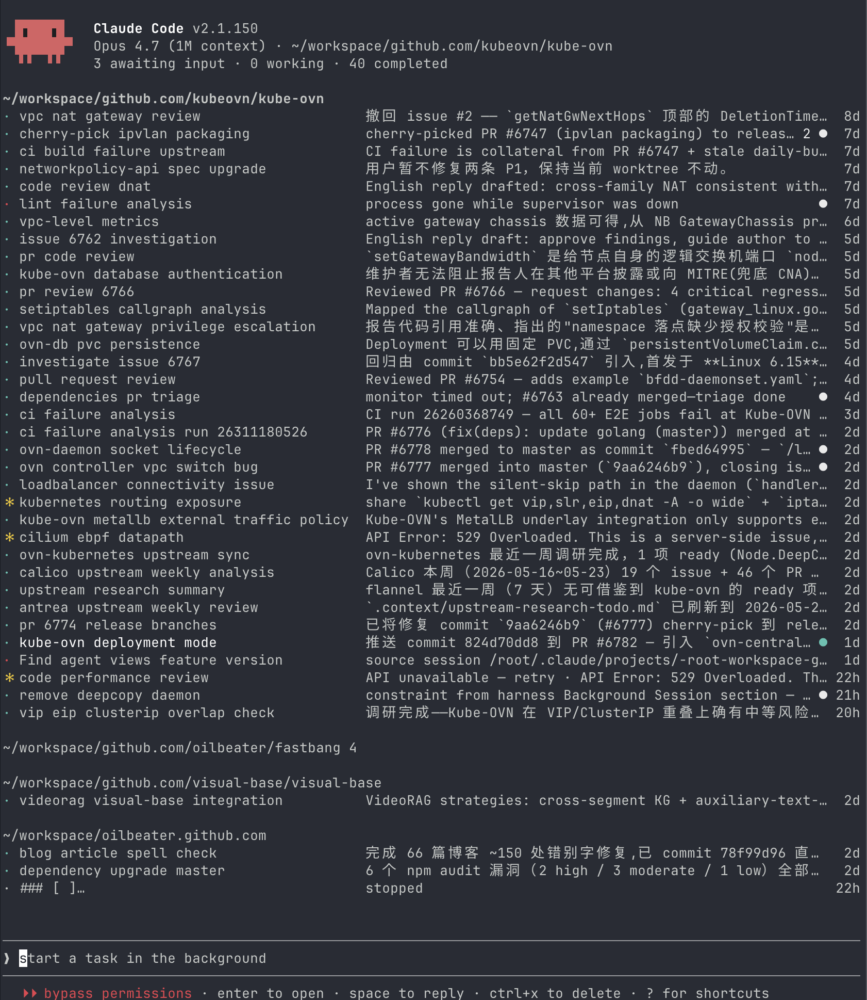

Claude Code 在 2.139 版本引入了 [Agent View](https://code.claude.com/docs/en/agent-view)，可以在一个界面里直接浏览多个项目下所有运行中和已结束的 session，方便更好地进行 session 管理和并行开发，在单个 terminal tab 下就能完成大量并发工作。

在我看来，这是一个 Agent 交互体验模式的重大提升，现阶段人们对它的重要性是大大低估了。

尽管这不是一个模型或者能力层面的更新，但这种用户体验的重新组织，极大提升了并行开发的效率。我之前其实已经回退到了线性开发的模式，因为我发现自己很难在多个任务之间进行快速的切换和响应。但是用了 Agent View 之后，我发现我可以开始大量并发工作了。

## 它解决了什么

**多 session 无法快速并发。** 之前如果想并发，需要不断地开窗口、开 Claude Code 再执行任务。但这个流程普通人很难适应。在我的意识里，开窗口是个很重的操作，而且当下发一个任务后，模型很快就开始输出了，注意力很自然就被吸引过去了，很难不去看直接开下一个窗口。而在 Agent View 里，任务默认是异步的，输入完 prompt 后直接后台执行，留下的输入框是给下一个任务准备的，不会有当前任务的干扰，很自然地就过渡到了下一个任务。避免了窗口的创建，对心智成本是一个很大的下降，把"启动"这一步变得容易了。

**多 session 难以管理。** 我之前为了并行处理，甚至写了个简单的 hook 让 Claude 每次执行完发铃声并且弹窗让我知道状态，但在多窗口的情况下还是很容易错过消息，忘记哪个窗口现在是什么状态。现在的 Agent View 里可以按状态展示 session，很轻松地看到哪个 session 等待我的输入，哪个还在工作，哪个已经完成。同样在一个窗口里快速浏览状态进行下一步操作，避免了窗口的切换。

**git worktree 管理困难。** 其实之前也可以通过 git worktree 来实现并发代码修改的隔离，但是 git worktree 的使用模式和普通开发流程还是有区别，并且还要求每次启动 Claude Code 的时候添加对应的参数，增加了额外的心智负担。而且之前的 session 是和 worktree 绑定的，很容易出现找不到的情况。在 Agent View 里的 session 如果涉及更改会自动启用 worktree 做隔离，对于使用者来说完全不知道有 worktree 的存在，极大降低了使用门槛。

**多个项目并发管理困难。** 现在直接在输入框 @ 项目名，就可以在项目目录下执行 Claude Code 操作，会直接使用对应目录的 Claude Code 配置，同样无需开窗口切换项目，减少了对人类上下文切换的开销。

## 设计思路

此外 Claude Code 还设计了一系列快捷操作来让 Agent View 更加方便。比如非 Agent View 管理的 session 可以通过 `/bg` 命令直接加入到 Agent View；通过键盘 `<-` 快速切换回 Agent View；通过 `Space` 展示 session 最近的会话并快速回复。一切的设计其实都是希望用户尽可能停留在 Agent View 页面，而不是进入到具体的某个 session 里。

这个设计理念很值得注意，它不是在现有模式上加一个管理面板，而是在尝试重新定义人与 Agent 的交互方式：从一个对话窗口变成一个有状态的任务面板。

## 现阶段的问题

当然，我也发现了它存在的几个问题：

1. 会有一个 daemon 常驻进程，我已经遇到了好几次把 CPU 打满的情况。
2. 每个 session 都会启动一个 Claude Code 进程，但是这个进程何时关闭并不清楚，很容易出现大量 Claude Code 进程把资源占满。
3. 输入框的交互和 session 内存在区别，比如无法 @ 文件，无法搜索历史。
4. slash command 只支持 skill，其他的内置命令比如看 usage 还是要进到 session 里去执行。
5. worktree 存在失效的情况，这个和我本地的 git 管理可能相关，如果之前的 CLAUDE.md 里规定了分支策略，就有可能 worktree 不被触发。

这些问题不影响我对这个方向的判断，Agent View 这种交互模式未来会成为标配。人们的注意力也会逐渐从当个 session 的管理，转移到更多工作的编排。
