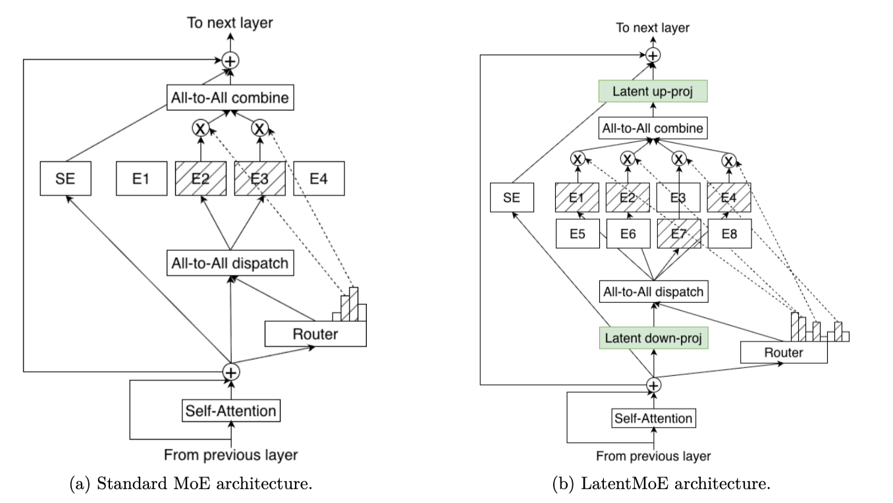

Kimi K3 发布时提到了 LatentMoE，恰巧最近在看 CS336 的时候也了解到了 LatentMoE。当时初看的时候就感觉这是一个很适合扩展模型规模的方法，现在看到它在 K3 这个 2.8T 参数量级的模型落地了。

## MoE 的问题

MoE 的最初理念是通过更好的稀疏性降低训练和推理的计算量，本质上是一个在计算能力有限的情况下，尽可能 Scale 模型规模的方法。它的做法是把传统的 FFN 层切分成多个小的 expert，然后在前面加一个 router 每一层只激活部分的 expert 来降低计算量。如下图左侧所示。

这种方法从计算量的角度确实会带来显著的下降，但同时引入了通信的复杂度。因为 token 在经过 router 计算之后需要发送到被选中的 expert，而不同的 expert 可能分布在不同的 GPU 甚至不同的机器上，一份 token 就需要被不同 GPU 多次从显存和网络中加载，每个 expert 计算完后还会把数据再发送回去，这会挤占很宝贵的内存和网络带宽。而在推理过程中内存带宽的问题会更严重，MoE 中这种类似存储写放大的效果会对整体吞吐量带来很大的影响。

## LatentMoE 的解决方法

针对这个通信放大的问题，LatentMoE 并没有尝试去改变通信拓扑，它的解决方法是通过压缩和解压的方式降低传输量。具体的做法很类似 DeepSeek MLA 使用的压缩 KV Cache 的方式，首先通过一个压缩矩阵将 token 压缩到低维，接下来发送给各个 expert，各个 expert 计算完后发送回原先 token 所在的 GPU，再通过一个还原矩阵还原到原先的维度。详细的过程可以参考 [DeepSeek MLA -- 为成本优化而生的注意力机制](/2025/04/14/deepseek-mla/)。

和 MLA 类似，这个压缩并不是无损的，但是从最终的性能表现来看在 4x 的压缩率并扩展 expert 数量，性能可以得到保持。这其实也代表了最近几年来的一个演进趋势，不断地降低精度，降低密度，为的都是规模的提升，规模提升了性能就上去了，每个细节部分的精度可以为了规模的提升而让步。

另一方面由于引入了压缩和解压的计算，这一部分的计算量是增加了的，但是由于后续的 expert 维度降低，整体计算量并没有太大变化。但是由于内存通信占据了绝大多数的时间开销，即使计算量增加也是值得的。这也是 LLM 的一个性能优化的范式，尽可能降低内存的开销而不是只关注计算量的下降。

## 小结

Kimi K3 当前的博客里说使用的是 Stable LatentMoE，很有可能是 LatentMoE 的一个变种，期待后续的技术报告详细解释。

随着模型规模不断变大，其实可以看到一个明显趋势：大家在降低各个维度的精度，以尽可能提升模型规模。具体来说，包括数据类型从 FP32 一路降到 FP8、MoE 只激活部分 expert、MLA 对 KV Cache 进行压缩、各种 Sparse Attention 选择性计算和压缩 Attention，以及 LatentMoE 对 token 进行压缩。

所有这些方法都在尽可能减少扩展模型规模时的阻碍。期待能看到更多模型架构创新和更大规模的模型。
