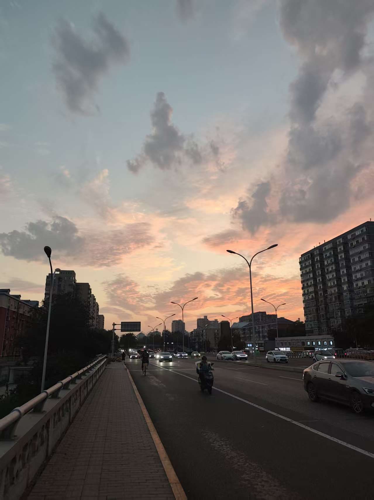
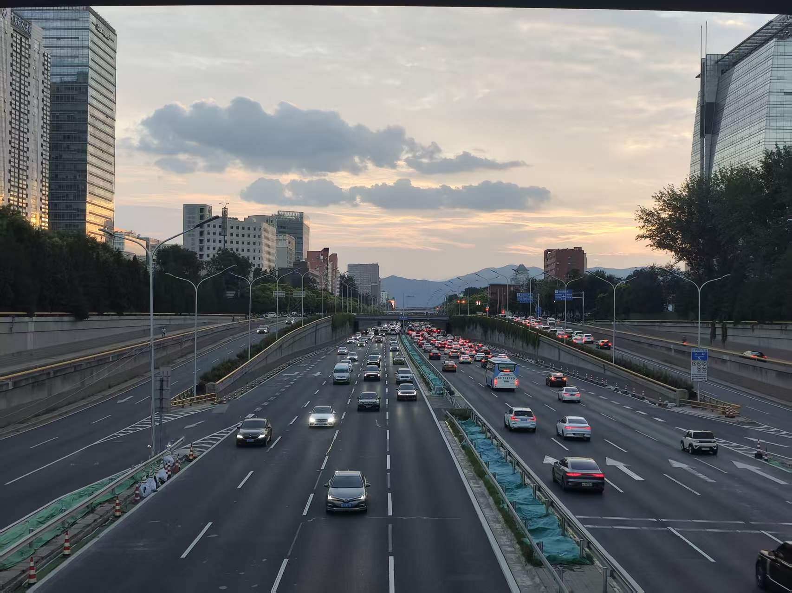
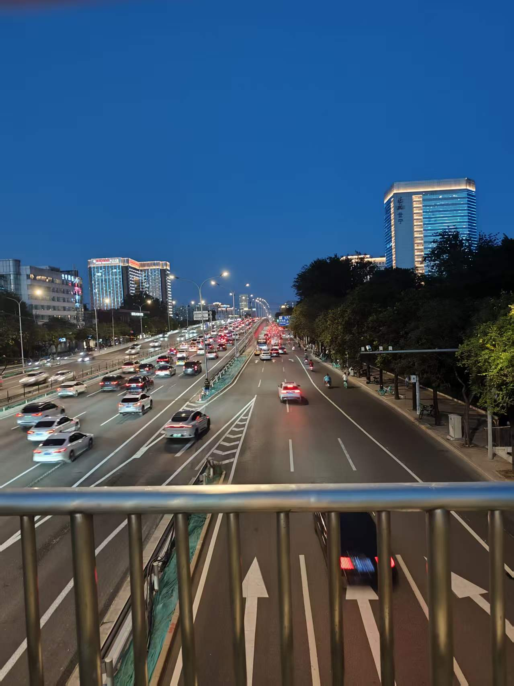
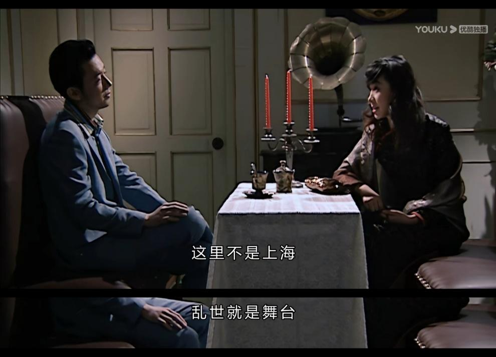

上次参与离职赛道，还是十一年前写下[为啥我要从阿里离职](https://oilbeater.com/2015/05/15/whyleaveali/)的时候。虽然语言风格和心境在这十来年里都发生了不小的变化，但是很开心自己还有当年做出转变的勇气。

什么时候开始有改变的念头呢？大概是有一次晚上走路回家突然出现了幻觉，我发现同一条回家的路已经走了五六年了，一时间产生了时空穿梭感，几年前就在走，现在还在走，明年也会走。

于是我开始尝试改变回家的路线，每天绕一条不同的弯路，穿过一个不同的小区，先反向走一段然后再回头，就这样每天变换路线、绕路寻找一些新鲜感。很快，二十分钟的路被我拉长到了一个多小时，最后我开始了一天绕到三环、一天绕到四环的大圈模式。顺便提一句，在三环的蓟门桥和四环的京张铁路公园天桥上，都能无意间发现很漂亮的夜景，相机完全记录不了那种发现的喜悦。

等到连这么逛都开始觉得无聊时，公司终于搬家了，结果你猜怎么着，只是搬到了隔壁的一栋楼，路线完全没发生变化。而且还搬回了十年前我刚来灵雀云时的那栋写字楼，又回到最初的起点，记忆中你青涩的脸。

当时间走到第十年时，我突然想起了当初来时给自己定下的目标。当年还是大众创业、万众创新的时候，我还想着未来要自己创业。但是没啥经验，所以还是先加入一个初创公司，十年后公司要么已经暴毙了，要么已经成功上市了，不管成功还是失败，我都能攒一波经验。结果十年过去了，这两件事都没发生，当时想的还是太简单了。

不过这些年经营 Kube-OVN 也算内部半创业了，我也发现我并不适合自己单干。主要原因是我本能地排斥把自己的东西拿出去商业化，我希望能把自己精心打磨的东西和赚钱这两件事分开。我更喜欢的方式是在 Issue 列表里像渣男翻牌子一样，没有什么心理负担地去临幸一个问题并把它解决，而不是签一个商业合同，陷入一段有责任的关系中。这种心态做社区还好，做公司肯定死了。

于是最近一年，我开始全职搞社区，不再管项目上的事情，但很快就感受到了 AI 对整个开源社区的冲击。当社区里所有的 Issue、PR 和 Comment 都由 AI 生成时，人和人之间的情感连接就消失了，社区完全变成了一个 Token 众包的生产模式。花了半天时间古法 Review 代码，对方一分钟就改完，再让你 Review 时的那种绝望感，很多开源社区的 Maintainer 应该都体验过。而且在大量使用 AI 编程后，自己和项目之间的情感连接也变淡了，感觉这是 AI 生出来的野孩子，自己也莫名其妙地从孩子亲妈慢慢变成了后妈。然后我就开始产生虚无主义了，觉得一切事情 AI 都能做，自己做什么都没有意义了。和其他 AI 讨论虚无主义时，我得到的都是一些片汤话，DeepSeek 却给了我下面这么一句：

> 如果外部世界没有现成的意义，那我们自己就是意义的唯一来源。这很艰难，但也意味着完全的自由。

然后我想明白了，人生的意义应该是自己定义的。

接下来我就开始考虑全面转型 AI 的事情了。ChatGPT 出现后，其实我预测对了很多事情，比如刚出现的时候，大家说文字工作者要不行了，但 AI 还不会思考，写程序肯定比不过程序猿。我当时的判断是，程序这个东西是可验证的，搜索空间也更小，反而是 AI 更容易解决的问题。现在来看，AI 写出的文字还是很容易被识别且让人反感的，但是已经几乎没人再手写代码了。再比如 DeepSeek 春节爆火前，我就已经发现它能力不一般，开始当自来水了。

前一阵听罗福莉在播客里说，MiMo 团队在组建的时候，很多人都没有相关的经验，但是都可以直接上手去训练模型。我当时就想，现在已经没有这个时间窗口了，没有经验的人已经很难从零开始参与大模型训练了。然后就发现，尽管我对 AI 的认知和判断不少都是对的，但是由于没有行动，这些机会窗口就这么关上了。比如 ChatGPT 出现后应该重仓寒武纪，比如发现 DeepSeek 后应该在春节前炒 DeepSeek 概念股，更应该想办法尽早参与这个浪潮。

之前一直犹豫，一个很大的原因是 Kube-OVN 社区这两年还是比较成功的。我们已经慢慢把非红帽系的 KubeVirt 厂商包圆了，现在 Kube-OVN 的主力用户都是欧洲的各大通信运营商和主权云。虽然我们从来不说要做国际化，也不做推广，也从来不找大厂站台，但在我们不断打磨产品的过程中，这件事已经自然发生了。但是这种成功在一定程度上也成了我转型 AI 时无法割舍的一部分。

接着，我在三月份查出了肾结石，折腾了两个月，做了两次碎石手术才把一侧的结石排干净。另一侧的结石由于位置原因不好排出，也不好做手术，相当于还埋了一个雷。一方面感受到了 AI 浪潮的窗口正在关闭，另一方面又感受到了自己年富力强的时间窗口也要关闭了。想到这就没啥好再犹豫的了，之前的成功应该成为之后旅程的后盾，而不应该成为前进的阻碍。

即使在 AI 的竞争中失败了，Kube-OVN 也能为我提供骨灰盒和棺材板的本钱。十一年前我还啥都不是，都敢放下在杭州还没盖好的房子，降薪来灵雀云，从结果上看也没什么负反馈，为什么现在又变得犹犹豫豫呢？

于是我就上路了，而且是一路催着、赶着，不管不顾地要加速上船，一个来月就搞定了。这一路要感谢 yihong 大哥的帮助和精神氮泵，大哥的 [tg 频道](https://web.telegram.org/k/#@hyi0618) 里有很多资料，都是我这段时间学习时要用到的。

尽管前路艰险，但是我很高兴自己又找回了十一年前的勇气，可以再去浪一把。

